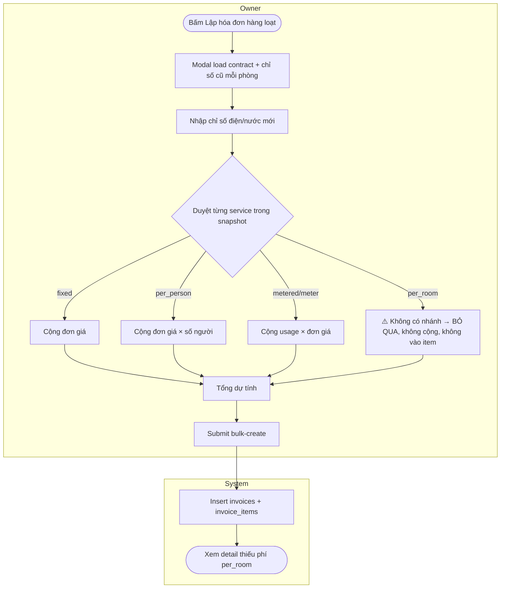
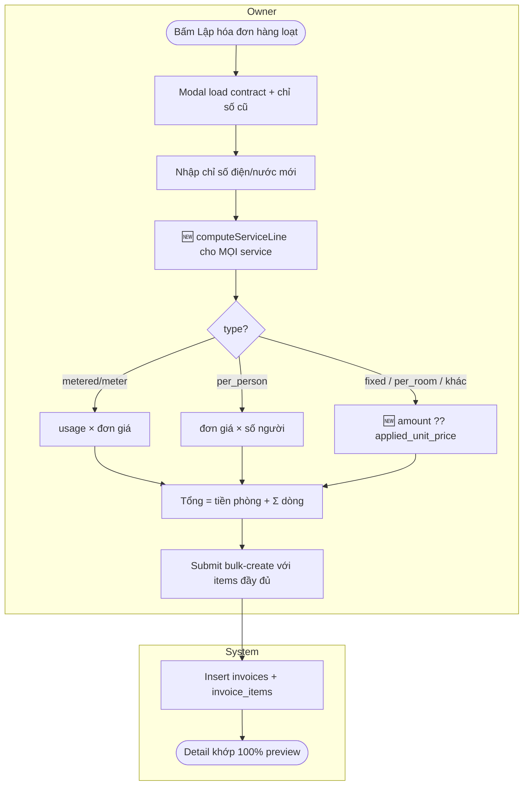
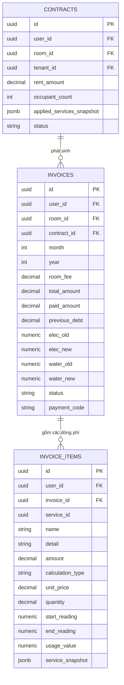

# Lập hóa đơn hàng loạt — Tính & hiển thị phí dịch vụ — BA Spec
**Version:** 1.0 | **Ngày:** 2026-06-30 | **BA:** Senior BA Agent
**Status:** Implemented

> **Trạng thái triển khai (2026-06-30):**
> - ✅ G-01/G-02 (BR-01..05, BR-08): gộp `computeServiceLine` + xử lý `per_room`/flat — `BulkInvoiceModal.tsx`.
> - ✅ G-03 (BR-06): nhận diện điện/nước theo `category` trước, fallback `name`.
> - ✅ G-04: `category` đã có sẵn ở nhánh rebuild snapshot (`GET /rental/contracts/:id`) → không cần sửa.
> - ✅ G-05: breakdown phí (tiền phòng + từng dịch vụ + số tiền) hiển thị dưới mỗi phòng trong modal.
> - Backend `POST /invoices/bulk-create` không đổi (đã lưu items + total đúng từ payload).
> - Build web-admin + backend tsc: PASS.

---

## 1. Tổng quan

**Mục tiêu nghiệp vụ:** Khi chủ trọ đã cấu hình dịch vụ trên hợp đồng (điện, nước, wifi, rác, phí cố định…), thao tác "Lập hóa đơn hàng loạt" phải tự động cộng đúng **toàn bộ** phí dịch vụ vào tổng tiền của từng hóa đơn, và khi xem chi tiết hóa đơn phải hiển thị đầy đủ, chính xác từng dòng phí.

**Scope:**
- Màn hình "Lập hóa đơn hàng loạt" (web-admin `BulkInvoiceModal`).
- Tính tổng dự tính (preview) + dựng `invoice_items` khi tạo.
- Đảm bảo 5 loại dịch vụ đều được tính: `fixed`, `per_room`, `per_person`, `metered`, `meter`.
- Detail hóa đơn (`GET /invoices/:id`) hiển thị đúng từng dòng.

**Out of scope:**
- Không sửa luồng lập hóa đơn đơn lẻ (`/invoices/new`) — đã đúng, chỉ dùng làm chuẩn đối chiếu.
- Không thay đổi cấu trúc bảng DB (chỉ dùng schema hiện có).
- Không xử lý prorate tiền phòng theo ngày trong luồng hàng loạt (đơn lẻ mới có) — ghi nhận ở Open Questions.
- Không đổi cơ chế nhập chỉ số điện/nước (giữ nhập tay từng phòng).

**Trigger:** Chủ trọ ở trang Hóa đơn → bấm "Lập hóa đơn (N phòng)" → mở modal hàng loạt.

**End state:** Mỗi phòng được tạo 1 hóa đơn có `total_amount` = tiền phòng + tổng phí dịch vụ tính đúng, kèm các `invoice_items` mô tả chính xác từng dòng; xem detail khớp 100% với preview.

**Users:** OWNER (chủ trọ), SUPER_ADMIN.

---

## 2. Quy trình (Process Flow)

### AS-IS — Quy trình hiện tại

**Pain points:**
- ⚠️ **Dịch vụ `per_room` (wifi, rác, phí cố định theo phòng) bị bỏ sót hoàn toàn**: không cộng vào `total_amount`, không tạo `invoice_item` → tổng sai (thiếu tiền) và detail thiếu dòng.
- ⚠️ Logic tính ở 2 nơi (`calculateTotal` và `buildInvoicePayload`) **viết lặp** → nguy cơ lệch giữa số preview và số lưu DB.
- ⚠️ Nhận diện điện/nước **chỉ dựa vào tên** (`name` chứa "điện"/"nước") → dễ sai nếu đặt tên khác, dù snapshot đã có `category`.

### TO-BE — Quy trình đề xuất

**Thay đổi so với AS-IS:**
| Bước | Thay đổi | Lý do |
|------|----------|-------|
| Tính phí từng service | 🆕 Thêm nhánh `per_room` + gộp mọi flat-fee | Sửa lỗi bỏ sót, đúng tổng + detail |
| `calculateTotal` & `buildInvoicePayload` | ✏️ Gộp về 1 hàm `computeServiceLine` | 1 nguồn sự thật → preview = DB |
| Nhận diện điện/nước | ✏️ Ưu tiên `category`, fallback `name` | Bền vững khi đổi tên dịch vụ |

---

## 3. Data Model

### Entity Relationship

### Chi tiết Entity trọng tâm

#### applied_services_snapshot (phần tử trong mảng jsonb của CONTRACTS)

| Field | Tên nghiệp vụ | Type | Nullable | Validation | Source | Mô tả |
|-------|--------------|------|----------|-----------|--------|-------|
| service_id | ID dịch vụ | UUID | No | — | Config | Tham chiếu service gốc |
| name | Tên dịch vụ | String | No | non-empty | Config | "Tiền điện", "Wifi"… |
| type | Cách tính | Enum | No | fixed/per_person/per_room/metered/meter | Config | Quyết định công thức |
| category | Nhóm | String | Yes | electricity/water/wifi/trash/parking/other | Config | Dùng nhận diện điện/nước |
| applied_unit_price | Đơn giá áp dụng | Decimal | No | ≥ 0 | Config | Đã chọn giá thường/giá AC |
| amount | Thành tiền tính sẵn | Decimal | Yes | ≥ 0 | Config | Có sẵn cho fixed/per_room/per_person |
| occupant_count | Số người (snapshot) | Int | Yes | ≥ 1 | Config | Cho per_person |
| is_metered | Cờ theo chỉ số | Boolean | Yes | — | Config | Hỗ trợ nhận diện metered |

#### INVOICE_ITEMS (mỗi dòng phí của hóa đơn)

| Field | Type | Nullable | Validation | Mô tả |
|-------|------|----------|-----------|-------|
| name | String | No | non-empty | Tên dòng phí |
| detail | String | Yes | — | Diễn giải ("12 → 50 = 38 x 3.500", "100.000 / kỳ") |
| amount | Decimal | No | ≥ 0 | Thành tiền dòng |
| calculation_type | String | Yes | fixed/per_person/per_room/metered/meter | Loại tính |
| unit_price | Decimal | Yes | ≥ 0 | Đơn giá |
| quantity | Decimal | Yes | ≥ 0 | Số lượng/usage/số người |
| start_reading / end_reading / usage_value | Numeric | Yes | ≥ 0 | Chỉ cho metered |

**Quan hệ:**
- `contracts` → `invoices`: One-to-Many.
- `invoices` → `invoice_items`: One-to-Many. `total_amount` phải = `room_fee` + Σ(`invoice_items.amount`).

---

## 4. Business Rules

> Dev PHẢI implement đúng. Không có exception ngoài bảng này.

| ID | Rule | Điều kiện | Hành động | Edge case |
|----|------|-----------|-----------|-----------|
| BR-01 | Tính dòng metered | IF type ∈ {metered, meter} | THEN amount = max(0, new − old) × applied_unit_price | new < old → usage = 0, amount = 0 (không âm) |
| BR-02 | Tính dòng per_person | IF type = per_person | THEN amount = applied_unit_price × occupant_count | occupant_count thiếu → mặc định 1 |
| BR-03 | Tính dòng flat | IF type ∈ {fixed, per_room} hoặc type khác | THEN amount = amount ?? applied_unit_price ?? 0 | Cả amount & applied_unit_price thiếu → 0 |
| BR-04 | Tổng hóa đơn | luôn | THEN total_amount = room_fee + Σ(amount mọi service) (+ previous_debt nếu có) | snapshot rỗng → total = room_fee |
| BR-05 | Preview = Persisted | luôn | Số hiển thị "Tổng dự tính" = total_amount lưu DB = Σ invoice_items + room_fee | Bắt buộc dùng chung 1 hàm tính |
| BR-06 | Nhận diện điện/nước (cho metered) | IF type metered | THEN xác định elec/water theo category trước, fallback name keyword | metered nhưng không phải elec/water & không có chỉ số → amount = 0, vẫn tạo item |
| BR-07 | Chống trùng | IF đã tồn tại invoice cùng (room_id, contract_id, month, year, user_id) | THEN bỏ qua, trả lỗi "Hóa đơn đã tồn tại" | Không tạo trùng |
| BR-08 | Mọi service tạo 1 item | IF service có trong snapshot | THEN luôn tạo 1 invoice_item (kể cả amount = 0) | Không im lặng bỏ dòng |

**BR-03 — Flat fee (trọng tâm sửa lỗi):**
- Điều kiện: type không phải per_person và không phải metered/meter (bao gồm `per_room`, `fixed`, hoặc giá trị lạ).
- Hành động: `amount = Number(s.amount ?? s.applied_unit_price ?? 0)`, detail = "`<amount>` / kỳ".
- Ví dụ: Wifi `per_room`, applied_unit_price = 100.000 → dòng "Wifi · 100.000 / kỳ", amount = 100.000, được cộng vào total.

---

## 5. Acceptance Criteria

**AC-01: per_room được cộng vào tổng (lỗi gốc)**
- **Given:** Hợp đồng phòng 201 có Wifi (`per_room`, 100.000) + tiền phòng 3.000.000.
- **When:** Lập hóa đơn hàng loạt phòng 201 (không có điện/nước).
- **Then:** Tổng dự tính = 3.100.000; hóa đơn tạo ra có `total_amount` = 3.100.000 và 1 invoice_item "Wifi" amount 100.000.

**AC-02: Happy path đầy đủ dịch vụ**
- **Given:** HĐ có tiền phòng 2.000.000; Điện `metered` 3.500/kWh (cũ 10); Nước `per_person` 50.000 (2 người); Wifi `per_room` 80.000.
- **When:** Nhập điện mới = 50; submit.
- **Then:** Điện = (50−10)×3.500 = 140.000; Nước = 50.000×2 = 100.000; Wifi = 80.000; `total_amount` = 2.000.000+140.000+100.000+80.000 = 2.320.000. Detail hiển thị 3 dòng đúng diễn giải.

**AC-03: Preview khớp detail sau khi lưu**
- **Given:** Bất kỳ phòng nào ở AC-02.
- **When:** Tạo xong, mở `GET /invoices/:id`.
- **Then:** `total_amount` và danh sách items khớp 100% số ở modal preview.

**AC-04: Edge — chỉ số mới ≤ cũ**
- **Given:** Điện cũ 50.
- **When:** Nhập điện mới = 40 (hoặc bỏ trống).
- **Then:** usage = 0, dòng điện amount = 0 (không âm), không chặn submit.

**AC-05: Edge — hợp đồng không có dịch vụ**
- **Given:** HĐ chỉ có tiền phòng, snapshot rỗng.
- **When:** Submit.
- **Then:** `total_amount` = room_fee, không có invoice_items, không lỗi.

**AC-06: Chống trùng**
- **Given:** Đã có hóa đơn phòng 201 kỳ T6/2026.
- **When:** Lập lại hàng loạt kỳ T6/2026.
- **Then:** Bỏ qua phòng 201, trả "Hóa đơn đã tồn tại", các phòng khác vẫn tạo.

---

## 6. Risk Register (Nghiệp vụ)

| ID | Risk | Likelihood | Impact | Score | Mitigation | Owner |
|----|------|-----------|--------|-------|-----------|-------|
| R-01 | Tổng tiền thiếu phí (per_room) gây thất thu/thu sai khách | 4 | 5 | 20 | BR-03 + AC-01/02; đối soát mẫu sau deploy | Owner |
| R-02 | Preview ≠ số thực lưu → mất niềm tin, tranh chấp với khách | 3 | 4 | 12 | BR-05 dùng chung 1 hàm tính | Dev |
| R-03 | Nhận diện điện/nước sai do tên dịch vụ lạ → tính nhầm | 2 | 4 | 8 | BR-06 ưu tiên category | Dev |

Risk thấp hơn (tóm tắt): hiển thị diễn giải chưa thân thiện (cosmetic), thiếu prorate kỳ đầu (đã out-scope).

---

## 7. Gap Analysis

| # | Chiều | Gap | AS-IS | TO-BE | Impact | Effort | Ưu tiên |
|---|-------|-----|-------|-------|--------|--------|---------|
| G-01 | Process | per_room bị bỏ sót khi tính | Không cộng | Cộng đủ (BR-03) | H | L | P1 |
| G-02 | Code | Logic tính lặp 2 nơi | calculateTotal + buildPayload | 1 hàm computeServiceLine | M | L | P1 |
| G-03 | Data | Nhận diện điện/nước theo tên | name string match | category-first | M | L | P2 |
| G-04 | Data | Rebuild snapshot thiếu `category` ở `GET /rental/contracts/:id` | thiếu | bổ sung category vào map rebuild | M | L | P2 |
| G-05 | UX | Modal không show breakdown phí | chỉ tổng | liệt kê dòng phí dưới mỗi phòng | L | M | P3 |

---

## 8. Dependencies & Constraints

**Phụ thuộc:**
- `contracts.applied_services_snapshot` phải được tạo đúng khi tạo HĐ (POST /contracts đã set đủ field gồm category, applied_unit_price, amount).

**Constraints:**
- Không đổi schema DB. Chỉ dùng cột hiện có.
- Backend `POST /invoices/bulk-create` đã lưu `items` + `total_amount` từ payload → fix tập trung ở client dựng payload (đảm bảo payload đúng).

**Integrations:** `GET /rental/contracts/:id`, `GET /invoices/latest-meter-readings`, `POST /invoices/bulk-create`, `GET /invoices/:id`.

---

## 9. Assumptions & Open Questions

**Assumptions:**
- Phí cố định (`per_room`, `fixed`) lấy thẳng từ config HĐ, **không cần ô nhập** trong modal hàng loạt (chỉ điện/nước cần nhập chỉ số). Nếu sai → cần thêm UI nhập.
- `applied_unit_price` trong snapshot đã là giá đúng (đã xử lý giá AC). Nếu sai → phải tính lại giá AC ở client.
- previous_debt không tự tính trong luồng hàng loạt (mặc định 0) trừ khi payload truyền vào.

**Open Questions:**
| # | Câu hỏi | Người trả lời | Ảnh hưởng nếu chưa có |
|---|---------|--------------|----------------------|
| Q-01 | Luồng hàng loạt có cần prorate tiền phòng kỳ đầu như đơn lẻ không? | Owner | Ảnh hưởng cách tính room_fee |
| Q-02 | Có cần cho sửa phí cố định ngay trong modal (override) không? | Owner | Ảnh hưởng UI + payload |
| Q-03 | Dịch vụ metered ngoài điện/nước (vd gas theo chỉ số) có dùng không? | Owner | Cần thêm ô nhập chỉ số tổng quát |

---

## 10. Glossary

| Thuật ngữ | Định nghĩa trong context | Không nhầm với |
|-----------|--------------------------|----------------|
| per_room | Phí cố định theo phòng/kỳ (wifi, rác) | per_person (theo đầu người) |
| metered/meter | Tính theo chỉ số đầu–cuối (điện, nước) | fixed (cố định) |
| applied_services_snapshot | Bản chụp cấu hình dịch vụ tại thời điểm tạo HĐ | services (bảng cấu hình gốc) |
| applied_unit_price | Đơn giá đã chốt trong snapshot | unit_price (giá gốc service) |
