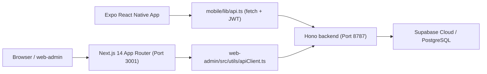

# Architecture Context & Runtime Topology

This document describes the runtime topology, service mounting, and middleware authorization flows that secure and drive the TrọCare application.

## 1. Runtime Topology
TrọCare is structured as a monorepo consisting of a mobile app (primary), a web admin dashboard, and a Hono-based backend.

## 2. Codebase Structure & Active Paths
The monorepo separates active developments from legacy codebases:

- **`mobile/`**: **Primary** — Active Expo React Native mobile application (landlord-facing).
  - `mobile/app/`: Expo Router file-based routing (tabs layout, screen stacks).
  - `mobile/app/(tabs)/`: Bottom tab navigation (Home/Dashboard, Invoices, Transactions, Settings).
  - `mobile/lib/api.ts`: Core fetch client with JWT access/refresh token management.
  - `mobile/lib/auth.ts`: Google OAuth integration and session management.
  - `mobile/lib/rentalOps.ts`: All business logic API callers (~100+ exported functions).
  - `mobile/store/`: Zustand state management stores (facilityStore, etc.).
  - `mobile/components/`: Shared React Native UI components.
  - `mobile/constants/`: Theme colors, spacing, typography tokens.
- **`web-admin/`**: Active Next.js 14 Web Administration dashboard.
  - `web-admin/src/app/(owner-ops)/`: Owner operations (facilities, contracts, invoices, payments).
  - `web-admin/src/app/admin/`: System admin pages.
  - `web-admin/src/app/public/`: Public marketplace pages.
  - `web-admin/src/lib/rentalOps.ts`: Web client-side business logic helper.
  - `web-admin/src/utils/apiClient.ts`: Axios client with error handling.
- **`backend/`**: Active Bun/Hono backend API.
  - `backend/src/index.ts`: Application entry point mounting all route modules.
  - `backend/src/routes/`: 14 route modules (auth, rental, invoices, transactions, etc.).
  - `backend/src/migrations/`: SQL migration files (001 to 023).
  - `backend/src/utils/`: Shared utilities (wallet balance, rent calculation, validation).
- **`money-manager/`** & **`money-manager-backend-express/`**: Legacy applications preserved for reference. Do not modify.

## 3. Backend Routing Table
`backend/src/index.ts` maps domain paths to the following modular route handlers:

| Prefix | Route Module | Domain / Purpose |
|---|---|---|
| `/health` | `routes/health.ts` | Server health and Supabase connectivity checks. |
| `/auth` | `routes/auth.ts` | Login (Google & admin), logout, token refresh, and identity checks (`/auth/me`). |
| `/me` | `routes/profile.ts` | Profile retrieval, onboarding completion, and profile updates. |
| `/locations` | `routes/locations.ts` | Geographic static lists (Provinces, Districts). |
| `/public` | `routes/public.ts` | Public boarding houses, rooms, leads, and bookings. |
| `/admin` | `routes/admin.ts` | System statistics, user roles, user block/unblock, and global listings CRUD. |
| `/owner` | `routes/owner.ts` | Owner-specific boarding houses, rooms, leads, bookings, messages, and settings. |
| `/wallets` | `routes/wallets.ts` | Payment wallets (bank, cash, e-wallet) CRUD. |
| `/categories` | `routes/categories.ts` | Income and expense transaction ledger categories. |
| `/transactions` | `routes/transactions.ts` | Financial ledger transaction entries. |
| `/rental` | `routes/rental.ts` | Rental room, tenant, service, and contract management. |
| `/invoices` | `routes/invoices.ts` | Invoice details, calculations, payment registration, and bulk actions. |
| `/trading` | `routes/trading.ts` | Inventory and boarding house trading items. |
| `/bank-config` | `routes/bankConfig.ts` | Owner bank account configuration for automatic QR generation. |

## 4. Auth & Onboarding Profile Guards

Security is enforced at both the browser boundary and the backend service layer to ensure un-onboarded owners cannot access administrative features.

### Frontend Guards
- **Route Middleware (`web-admin/middleware.ts`)**: Reads cookies to verify token existence, user role, and onboarding profile completion state. Automatically redirects:
  - Unauthorized visitors to `/login/owner` or `/login/admin`.
  - Un-onboarded owners (`isProfileCompleted: false`) to `/complete-profile`.
- **Workspace Verification Shell (`OwnerWorkspaceShell.tsx`)**: Re-authenticates runtime context by calling `/auth/me` and `/me/profile` upon shell mounting, refreshing session cookies to prevent storage drift.
- **Client Error Interceptors (`apiClient.ts`)**: Intercepts HTTP `403 PROFILE_REQUIRED` responses and redirects the browser to `/complete-profile`.

### Backend Guards
- **`requireAuth`**: Validates the Bearer JWT from headers, checks token expiration, and binds the authenticated user payload to Hono context (`c.set("user", currentUser)`).
- **`requireCompletedProfile`**: Evaluates `is_profile_completed` on the authenticated user. If false, immediately interrupts request processing and returns `403 PROFILE_REQUIRED`.

#### Covered vs. Exempt Backend Paths
`requireCompletedProfile` is selectively bypassed to allow onboarding:

- **Exempt (Allowed during onboarding)**: `/auth/*`, `/me/profile`, `/me/profile/complete`, `/locations/*`, `/public/*`.
- **Guarded (Profile required)**: `/owner/*`, `/wallets/*`, `/categories/*`, `/transactions/*`, `/rental/*`, `/invoices/*`, `/trading/*`.

## 5. Security & Isolation Notes
- **Supabase Client**: Standard operations utilize the service-role client (`supabaseAdmin`) or user-scoped JWT validation depending on whether direct RLS is active in the targeted phase.
- **Data Isolation**: Multi-tenant data partition is guaranteed by mandatory SQL filters on `owner_id` or `user_id` inside the active routes query builders.
