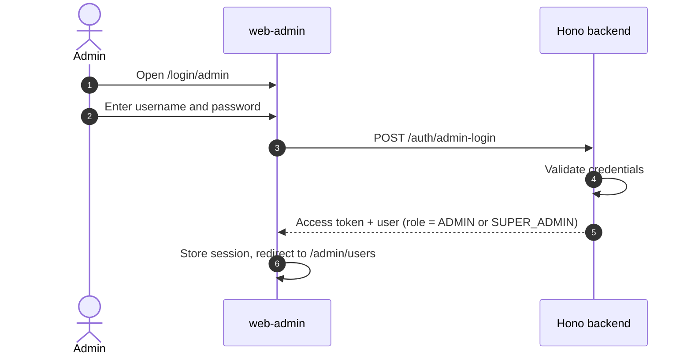
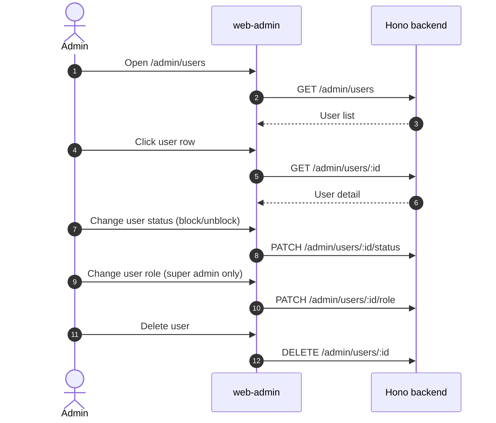

# Admin Management — Flow

## Admin Login Flow

```mermaid
sequenceDiagram
  autonumber
  actor Admin
  participant FE as web-admin
  participant BE as Hono backend

  Admin->>FE: Open /login/admin
  Admin->>FE: Enter username and password
  FE->>BE: POST /auth/admin-login
  BE->>BE: Validate credentials
  BE-->>FE: Access token + user (role = ADMIN or SUPER_ADMIN)
  FE->>FE: Store session, redirect to /admin/users
```

## User Management Flow

```mermaid
sequenceDiagram
  autonumber
  actor Admin
  participant FE as web-admin
  participant BE as Hono backend

  Admin->>FE: Open /admin/users
  FE->>BE: GET /admin/users
  BE-->>FE: User list
  Admin->>FE: Click user row
  FE->>BE: GET /admin/users/:id
  BE-->>FE: User detail
  Admin->>FE: Change user status (block/unblock)
  FE->>BE: PATCH /admin/users/:id/status
  Admin->>FE: Change user role (super admin only)
  FE->>BE: PATCH /admin/users/:id/role
  Admin->>FE: Delete user
  FE->>BE: DELETE /admin/users/:id
```
