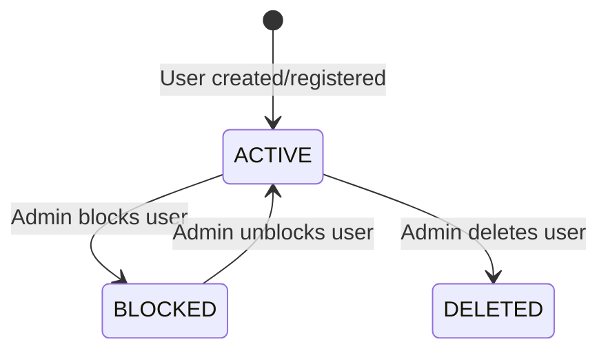

# Admin Management — State Machine

## User Status

## User Status Table
| Status | Meaning | Access |
|---|---|---|
| `active` | Normal account | Full access per role |
| `blocked` | Suspended by admin | Cannot authenticate |
| `deleted` | Removed by admin | Account removed |
