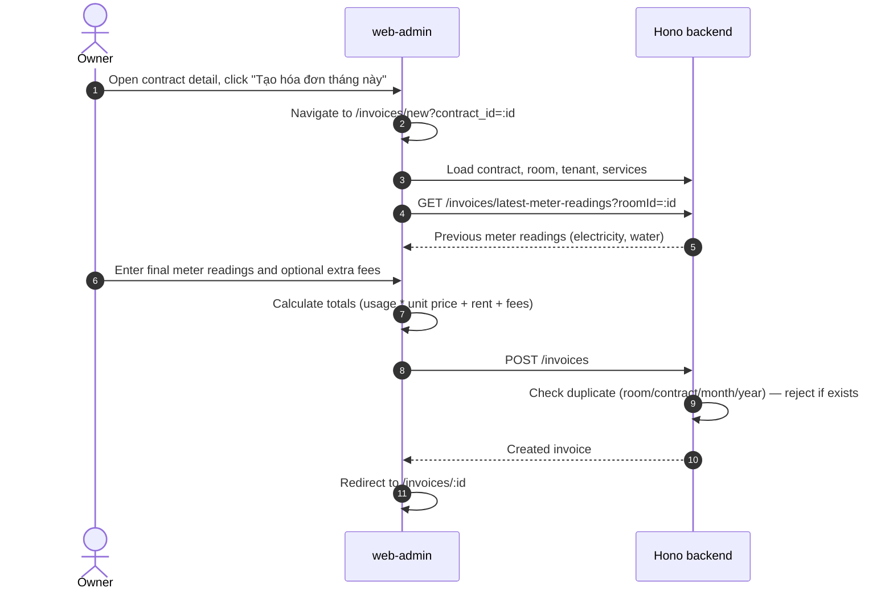
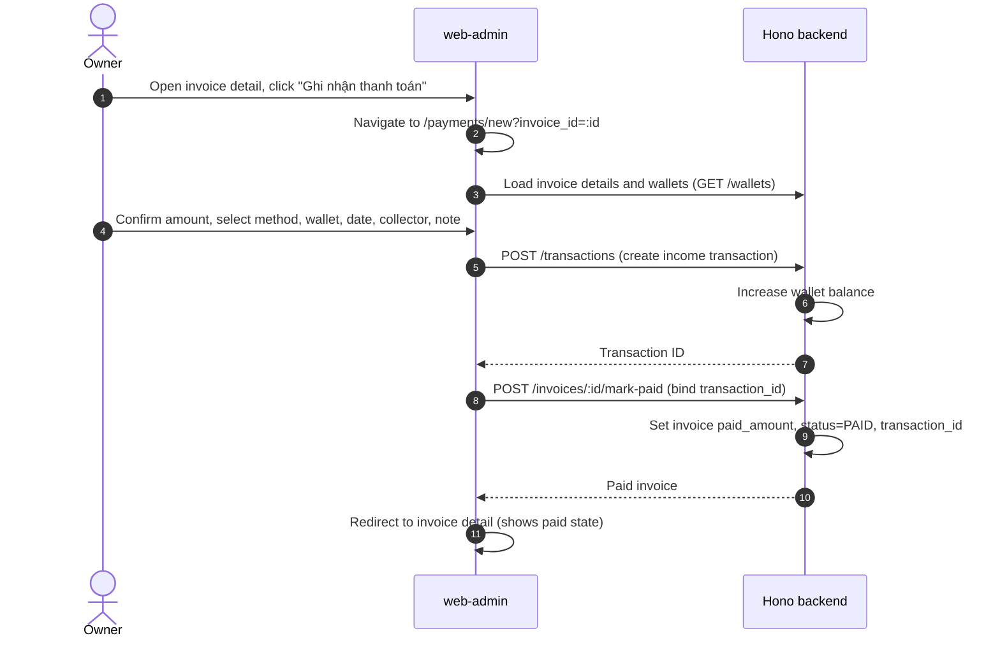

# Billing & Payments — Flow

## Create Invoice Flow

## Record Payment Flow

## Bulk Actions
- **Bulk Create**: `POST /invoices/bulk-create` — generates invoices for multiple rooms.
- **Bulk Collect**: `POST /invoices/bulk-collect-payment` — collects payments for multiple invoices.
- **Auto-Generate**: `POST /invoices/auto-generate` — generates draft invoices for all occupied rooms (not fully wired in FE).
