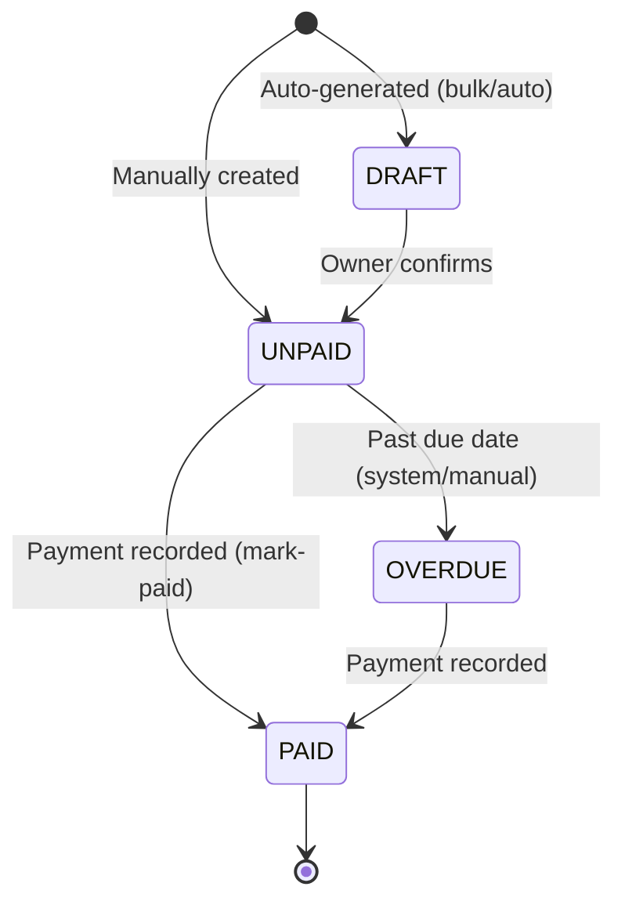

# Billing & Payments — State Machine

## Invoice Status Lifecycle

## Invoice Status Table

| Status | Meaning | Allowed Actions |
|---|---|---|
| `DRAFT` | Auto-generated, not yet confirmed | Edit, confirm, delete |
| `UNPAID` | Active invoice awaiting payment | Record payment, delete |
| `PAID` | Payment recorded and linked | View only |
| `OVERDUE` | Past due date, still unpaid | Record payment, delete |

## Transaction Linkage

| Event | Side Effect |
|---|---|
| `POST /transactions` | Wallet balance increased |
| `POST /invoices/:id/mark-paid` | Invoice `status=PAID`, `transaction_id` bound |
| `DELETE /invoices/:id` | Linked transaction deleted if present, wallet balance reversed |
