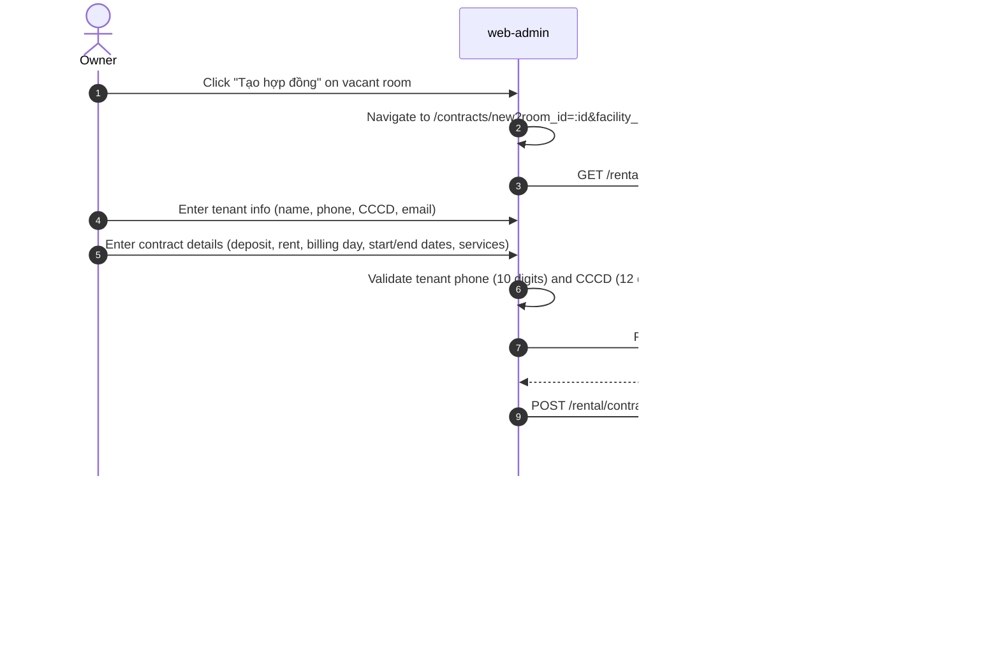
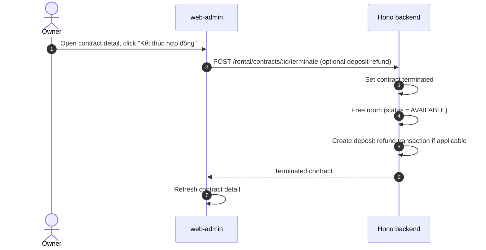
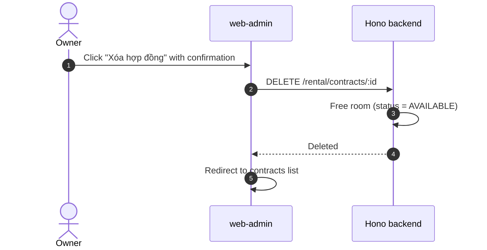

# Contract Management — Flow

## Create Contract Flow

```mermaid
sequenceDiagram
  autonumber
  actor Owner
  participant FE as web-admin
  participant BE as Hono backend

  Owner->>FE: Click "Tạo hợp đồng" on vacant room
  FE->>FE: Navigate to /contracts/new?room_id=:id&facility_id=:fid
  FE->>BE: GET /rental/rooms (load available rooms)
  Owner->>FE: Enter tenant info (name, phone, CCCD, email)
  Owner->>FE: Enter contract details (deposit, rent, billing day, start/end dates, services)
  FE->>FE: Validate tenant phone (10 digits) and CCCD (12 digits)
  FE->>BE: POST /rental/tenants
  BE-->>FE: Created tenant
  FE->>BE: POST /rental/contracts (with tenant_id, room_id, services)
  BE->>BE: Mark room status = OCCUPIED
  BE-->>FE: Created contract
  FE->>FE: Redirect to /contracts/:id
```

## Terminate Contract Flow

```mermaid
sequenceDiagram
  autonumber
  actor Owner
  participant FE as web-admin
  participant BE as Hono backend

  Owner->>FE: Open contract detail, click "Kết thúc hợp đồng"
  FE->>BE: POST /rental/contracts/:id/terminate (optional deposit refund)
  BE->>BE: Set contract terminated
  BE->>BE: Free room (status = AVAILABLE)
  BE->>BE: Create deposit refund transaction if applicable
  BE-->>FE: Terminated contract
  FE->>FE: Refresh contract detail
```

## Delete Contract Flow

```mermaid
sequenceDiagram
  autonumber
  actor Owner
  participant FE as web-admin
  participant BE as Hono backend

  Owner->>FE: Click "Xóa hợp đồng" with confirmation
  FE->>BE: DELETE /rental/contracts/:id
  BE->>BE: Free room (status = AVAILABLE)
  BE-->>FE: Deleted
  FE->>FE: Redirect to contracts list
```
