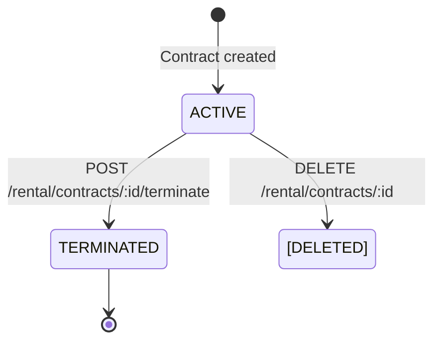

# Contract Management — State Machine

## Contract Lifecycle

## Room Side Effects

| Contract Event | Room Status Change |
|---|---|
| Contract created | Room → `OCCUPIED` |
| Contract terminated | Room → `AVAILABLE` |
| Contract deleted | Room → `AVAILABLE` |

## Tenant Status

Tenants are not deleted when contracts end. They persist as historical records and can be re-associated with future contracts.
