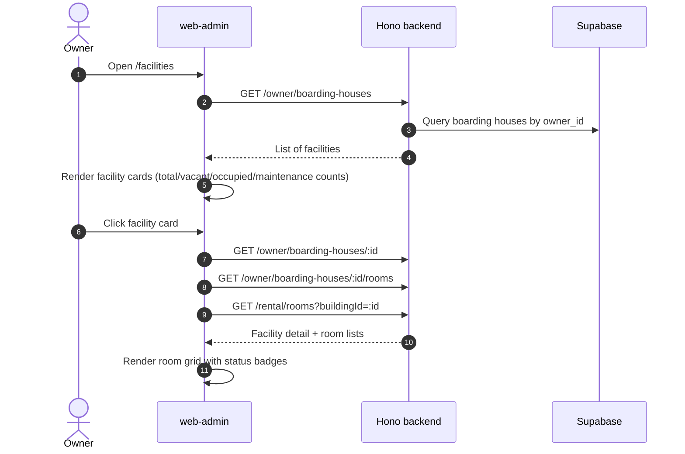
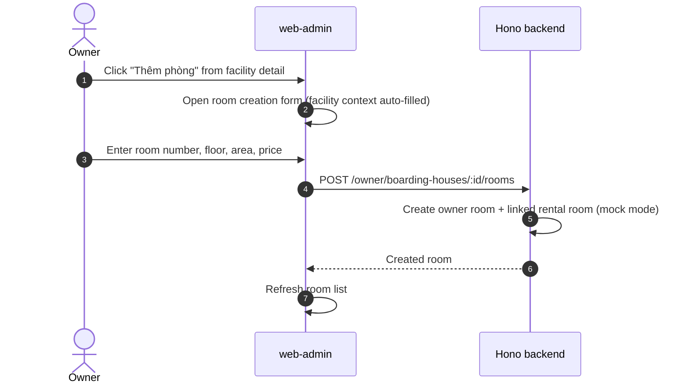

# Facility & Room Management — Flow

## Facility List & Detail Flow

```mermaid
sequenceDiagram
  autonumber
  actor Owner
  participant FE as web-admin
  participant BE as Hono backend
  participant DB as Supabase

  Owner->>FE: Open /facilities
  FE->>BE: GET /owner/boarding-houses
  BE->>DB: Query boarding houses by owner_id
  BE-->>FE: List of facilities
  FE->>FE: Render facility cards (total/vacant/occupied/maintenance counts)

  Owner->>FE: Click facility card
  FE->>BE: GET /owner/boarding-houses/:id
  FE->>BE: GET /owner/boarding-houses/:id/rooms
  FE->>BE: GET /rental/rooms?buildingId=:id
  BE-->>FE: Facility detail + room lists
  FE->>FE: Render room grid with status badges
```

## Room Creation Flow

```mermaid
sequenceDiagram
  autonumber
  actor Owner
  participant FE as web-admin
  participant BE as Hono backend

  Owner->>FE: Click "Thêm phòng" from facility detail
  FE->>FE: Open room creation form (facility context auto-filled)
  Owner->>FE: Enter room number, floor, area, price
  FE->>BE: POST /owner/boarding-houses/:id/rooms
  BE->>BE: Create owner room + linked rental room (mock mode)
  BE-->>FE: Created room
  FE->>FE: Refresh room list
```
