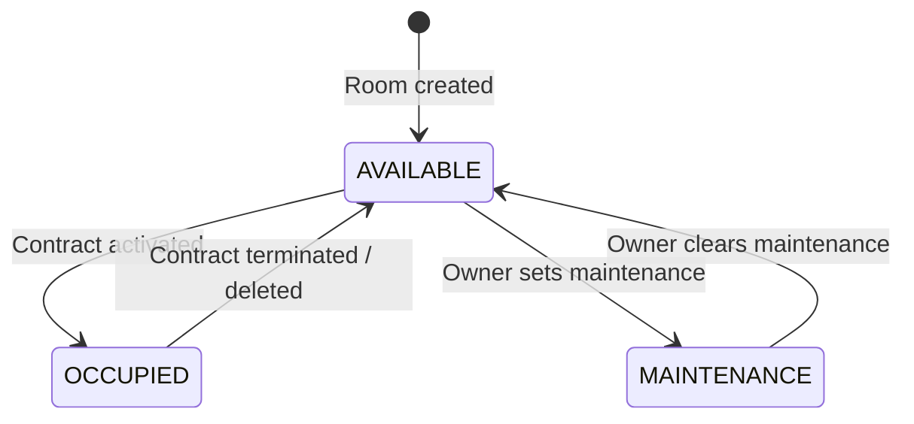
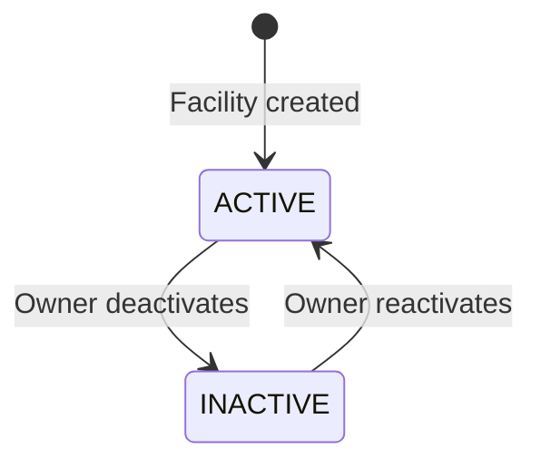

# Facility & Room Management — State Machine

## Room Status Lifecycle

## Facility Status

## Public Visibility Matrix

| Facility Status | Facility isPublic | Room Status | Room isPublic | Visible in Public Marketplace |
|---|---|---|---|---|
| ACTIVE | true | AVAILABLE | true | ✅ Yes |
| ACTIVE | true | OCCUPIED | true | ❌ No (occupied) |
| ACTIVE | false | AVAILABLE | true | ❌ No (facility hidden) |
| INACTIVE | true | AVAILABLE | true | ❌ No (facility inactive) |
