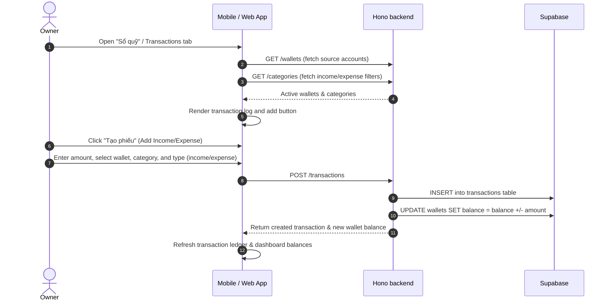
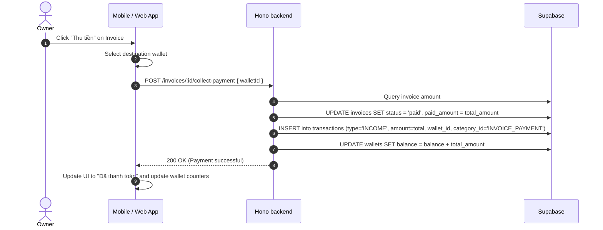

# Finance & Cash Flow — User Flows

## 1. Direct Bookkeeping Flow (Manual Income/Expense)

```mermaid
sequenceDiagram
  autonumber
  actor Owner
  participant FE as Mobile / Web App
  participant BE as Hono backend
  participant DB as Supabase

  Owner->>FE: Open "Sổ quỹ" / Transactions tab
  FE->>BE: GET /wallets (fetch source accounts)
  FE->>BE: GET /categories (fetch income/expense filters)
  BE-->>FE: Active wallets & categories
  FE->>FE: Render transaction log and add button
  
  Owner->>FE: Click "Tạo phiếu" (Add Income/Expense)
  Owner->>FE: Enter amount, select wallet, category, and type (income/expense)
  FE->>BE: POST /transactions
  BE->>DB: INSERT into transactions table
  BE->>DB: UPDATE wallets SET balance = balance +/- amount
  BE-->>FE: Return created transaction & new wallet balance
  FE->>FE: Refresh transaction ledger & dashboard balances
```

## 2. Integrated Invoice Payment Collection Flow

```mermaid
sequenceDiagram
  autonumber
  actor Owner
  participant FE as Mobile / Web App
  participant BE as Hono backend
  participant DB as Supabase

  Owner->>FE: Click "Thu tiền" on Invoice
  FE->>FE: Select destination wallet
  FE->>BE: POST /invoices/:id/collect-payment { walletId }
  BE->>DB: Query invoice amount
  BE->>DB: UPDATE invoices SET status = 'paid', paid_amount = total_amount
  BE->>DB: INSERT into transactions (type='INCOME', amount=total, wallet_id, category_id='INVOICE_PAYMENT')
  BE->>DB: UPDATE wallets SET balance = balance + total_amount
  BE-->>FE: 200 OK (Payment successful)
  FE->>FE: Update UI to "Đã thanh toán" and update wallet counters
```
