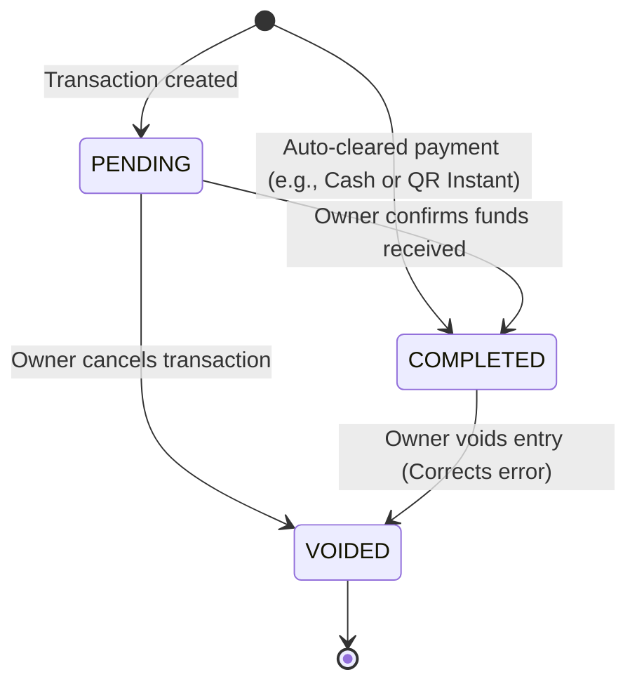

# Finance & Cash Flow — State Machine

Financial transactions transition between a set of deterministic states to ensure audit trails and prevent phantom accounting errors.

## 1. Transaction States

| State | Description | Balance Impact |
|---|---|---|
| `PENDING` | Transaction has been registered but cash or bank transfer has not cleared. | Balance is unaffected. |
| `COMPLETED` | Transaction is verified and cleared. | Wallet balance is adjusted. |
| `VOIDED` | Transaction was cancelled or corrected (e.g. incorrect invoice collection). | Wallet balance is reverted. |

## 2. State Transition Matrix

### Transition Triggers & Invariants
- **Deposit / Invoice Payment**: All invoice payment collections and booking deposits automatically bypass `PENDING` and enter `COMPLETED` state to ensure instant wallet updates.
- **Void Restriction**: A `VOIDED` transaction cannot be modified or re-activated. To correct a voided entry, a brand-new transaction must be generated.
