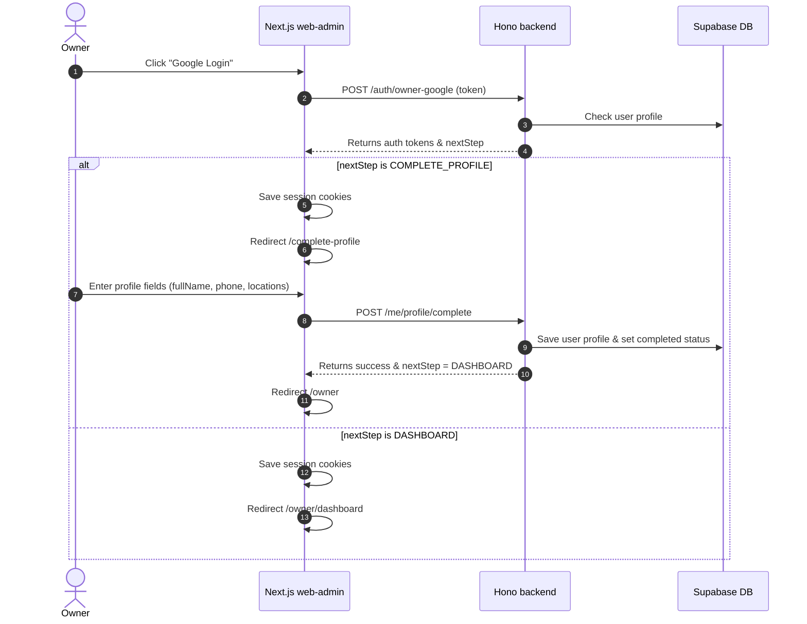

# Onboarding User Flows

The flow guides an owner from Google Login to Dashboard entry via profile verification.

## Sequence Diagram

```mermaid
sequenceDiagram
  autonumber
  actor Owner
  participant FE as Next.js web-admin
  participant BE as Hono backend
  participant DB as Supabase DB

  Owner->>FE: Click "Google Login"
  FE->>BE: POST /auth/owner-google (token)
  BE->>DB: Check user profile
  BE-->>FE: Returns auth tokens & nextStep
  alt nextStep is COMPLETE_PROFILE
    FE->>FE: Save session cookies
    FE->>FE: Redirect /complete-profile
    Owner->>FE: Enter profile fields (fullName, phone, locations)
    FE->>BE: POST /me/profile/complete
    BE->>DB: Save user profile & set completed status
    BE-->>FE: Returns success & nextStep = DASHBOARD
    FE->>FE: Redirect /owner
  else nextStep is DASHBOARD
    FE->>FE: Save session cookies
    FE->>FE: Redirect /owner/dashboard
  end
```
