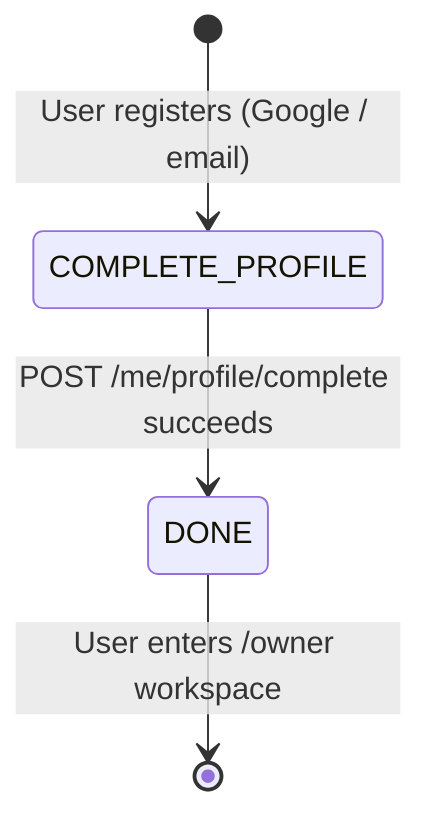

# Owner Onboarding — State Machine

## Onboarding Step Transitions

## State Table

| State | `is_profile_completed` | `onboarding_step` | Allowed Access | Next Action |
|---|---|---|---|---|
| Registered (new) | `false` | `COMPLETE_PROFILE` | `/complete-profile`, `/me/profile`, `/locations/*`, `/auth/*` | Fill profile form |
| Profile Completed | `true` | `DONE` | All owner/business routes | Enter dashboard |

## Transitions

| Trigger | From | To | Side Effects |
|---|---|---|---|
| `POST /me/profile/complete` success | `COMPLETE_PROFILE` | `DONE` | `users.is_profile_completed = true`, `users.onboarding_step = 'DONE'`, `users.name = fullName`, `user_profiles` row upserted |
