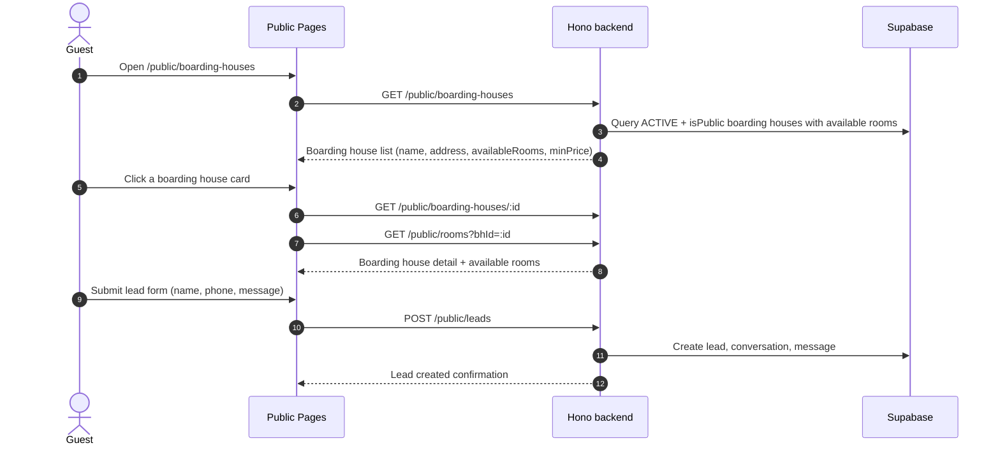
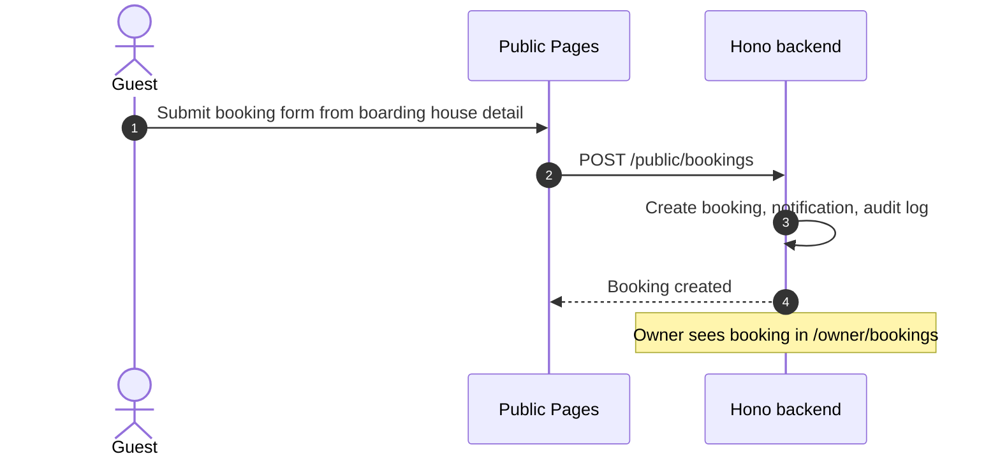

# Public Marketplace — Flow

## Guest Browsing & Lead Flow

```mermaid
sequenceDiagram
  autonumber
  actor Guest
  participant FE as Public Pages
  participant BE as Hono backend
  participant DB as Supabase

  Guest->>FE: Open /public/boarding-houses
  FE->>BE: GET /public/boarding-houses
  BE->>DB: Query ACTIVE + isPublic boarding houses with available rooms
  BE-->>FE: Boarding house list (name, address, availableRooms, minPrice)
  Guest->>FE: Click a boarding house card
  FE->>BE: GET /public/boarding-houses/:id
  FE->>BE: GET /public/rooms?bhId=:id
  BE-->>FE: Boarding house detail + available rooms
  Guest->>FE: Submit lead form (name, phone, message)
  FE->>BE: POST /public/leads
  BE->>DB: Create lead, conversation, message
  BE-->>FE: Lead created confirmation
```

## Guest Booking Flow

```mermaid
sequenceDiagram
  autonumber
  actor Guest
  participant FE as Public Pages
  participant BE as Hono backend

  Guest->>FE: Submit booking form from boarding house detail
  FE->>BE: POST /public/bookings
  BE->>BE: Create booking, notification, audit log
  BE-->>FE: Booking created
  Note over BE: Owner sees booking in /owner/bookings
```
