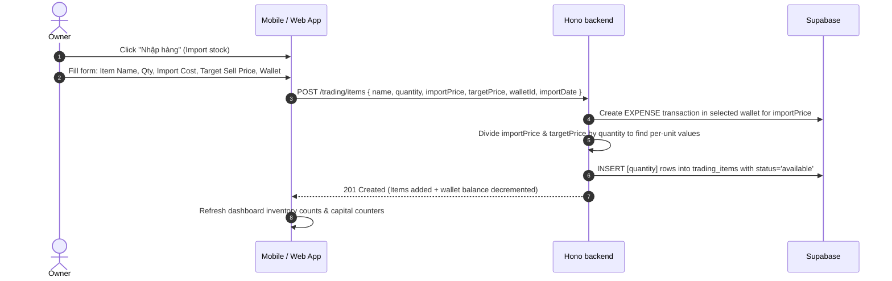
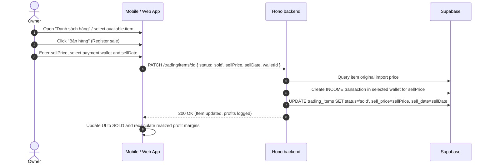

# Trading & Inventory — User Flows

## 1. Inventory Purchase / Import Flow
This flow represents buying items in bulk (or singular items) to add to the landlord's store.

## 2. Inventory Retail Sale Flow
This flow represents selling an available item from stock to a customer or tenant.

