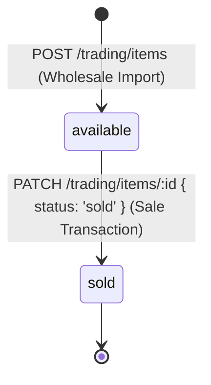

# Trading & Inventory — State Machine

Trading stock flows through a linear state machine tracking the path from wholesale import to final consumer sales.

## 1. Inventory States

| State | Description | Financial Status |
|---|---|---|
| `available` (or `holding` in legacy data) | The item is in physical inventory, unpaid by any customer. | Cost is logged as capital/asset (Unsold Capital). |
| `sold` | The item has been sold. Profit is realized. | Revenue is added to cash registers, realized profit is computed. |

## 2. State Transition Matrix

### Transition Safeguards
- **Status Mutability**: Once marked as `sold`, the item's `sell_price` and `sell_date` are recorded.
- **Unselling (Refunds)**: If a sale is cancelled, the owner must update status back to `available` and delete or void the associated `sell_transaction_id` to adjust wallet cash.
