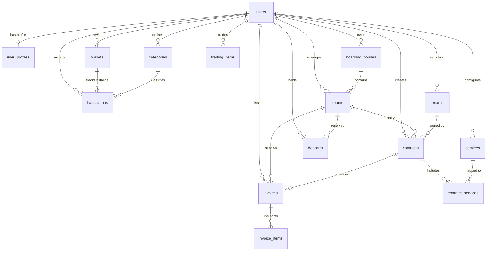

# Database Schema Structure & Rules

This document outlines the database tables, relations, and integrity rules powering the TrọCare Room Rental and Money Manager engine. The schema utilizes PostgreSQL (Supabase) with UUID primary keys across all tables.

> [!IMPORTANT]
> **Source of Truth**: The definitive schema is in `backend/src/migrations/016_full_uuid_reset.sql` (baseline) plus subsequent migrations `017`–`023`. This document summarizes the cumulative state after all migrations.

---

## 1. Relational Entity-Relationship Outline



---

## 2. Comprehensive Tables Definition

### Auth & Users Domain

#### `users`
- `id` (UUID, PK, DEFAULT `gen_random_uuid()`)
- `email` (VARCHAR 255, UNIQUE, NOT NULL) — Readonly in profile updates
- `name` (VARCHAR 255)
- `avatar` (TEXT)
- `role` (VARCHAR 20, CHECK: `USER`, `OWNER`, `ADMIN`, `SUPER_ADMIN`)
- `status` (VARCHAR 20, CHECK: `ACTIVE`, `BLOCKED`, `DELETED`)
- `provider` (VARCHAR 20, DEFAULT `GOOGLE`)
- `google_id` (VARCHAR 255, UNIQUE)
- `is_profile_completed` (BOOLEAN, DEFAULT `false`)
- `onboarding_step` (VARCHAR 50, DEFAULT `COMPLETE_PROFILE`)
- `full_name`, `phone`, `id_card` — Added by migration 018
- `last_login_at` (TIMESTAMPTZ)
- `created_at`, `updated_at` (TIMESTAMPTZ)

#### `user_profiles`
- `id` (UUID, PK)
- `user_id` (UUID, FK → `users.id`, UNIQUE)
- `full_name`, `phone` (TEXT)
- `province_code`, `province_name`, `district_code`, `district_name` (TEXT)
- `address_line`, `full_address` (TEXT)
- `avatar_url` (TEXT)
- `created_at`, `updated_at` (TIMESTAMPTZ)

#### `social_accounts`
- `id` (UUID, PK)
- `user_id` (UUID, FK → `users.id`)
- `provider` (VARCHAR 20)
- `provider_user_id` (VARCHAR 255)
- `email`, `name`, `avatar` (TEXT)
- `raw_data` (JSONB)
- UNIQUE(`provider`, `provider_user_id`)

#### `refresh_tokens`
- `id` (UUID, PK)
- `user_id` (UUID, FK → `users.id`)
- `token_hash` (VARCHAR 255) — Hashed refresh token
- `expires_at` (TIMESTAMPTZ)
- `revoked_at` (TIMESTAMPTZ, nullable)
- `created_at` (TIMESTAMPTZ)

#### `login_logs`
- `id` (UUID, PK)
- `user_id` (UUID, FK → `users.id`)
- `provider`, `ip_address`, `device_info` (TEXT)
- `login_at` (TIMESTAMPTZ)
- `success` (BOOLEAN)
- `fail_reason` (VARCHAR 100)

---

### Financial Domain

#### `wallets`
- `id` (UUID, PK)
- `user_id` (UUID, FK → `users.id`)
- `name` (VARCHAR 255, NOT NULL) — e.g., "Tiền mặt", "Vietcombank"
- `type` (VARCHAR 20, CHECK: `personal`, `rental`, `trading`)
- `icon` (VARCHAR 50)
- `color` (VARCHAR 20)
- `balance` (NUMERIC 14,2, DEFAULT 0) — Updated atomically on transactions
- `active` (BOOLEAN, DEFAULT `true`)
- `created_at`, `updated_at` (TIMESTAMPTZ)

#### `categories`
- `id` (UUID, PK)
- `user_id` (UUID, FK → `users.id`)
- `wallet_id` (UUID, FK → `wallets.id`, nullable)
- `parent_id` (UUID, FK → `categories.id`, nullable) — Hierarchical categories
- `name` (VARCHAR 255, NOT NULL) — e.g., "Tiền điện", "Mua sắm vật tư"
- `icon` (VARCHAR 50)
- `color` (VARCHAR 20)
- `type` (VARCHAR 20, CHECK: `income`, `expense`)
- `created_at`, `updated_at` (TIMESTAMPTZ)

#### `transactions`
- `id` (UUID, PK)
- `user_id` (UUID, FK → `users.id`)
- `wallet_id` (UUID, FK → `wallets.id`)
- `category_id` (UUID, FK → `categories.id`, nullable)
- `invoice_id` (UUID, FK → `invoices.id`, nullable) — Links payment to invoice
- `contract_id` (UUID, FK → `contracts.id`, nullable) — Added by migration 023
- `type` (VARCHAR 20, CHECK: `income`, `expense`, `transfer`)
- `amount` (NUMERIC 14,2, NOT NULL)
- `description` (TEXT) — Auto-generated for invoice payments, manual for general
- `date` (DATE, DEFAULT `CURRENT_DATE`)
- `image_uri` (TEXT, nullable) — Receipt photo. Added by migration 023
- `created_at`, `updated_at` (TIMESTAMPTZ)

---

### Trading Domain

#### `trading_categories`
- `id` (UUID, PK)
- `user_id` (UUID, FK → `users.id`)
- `name` (VARCHAR 255, NOT NULL)
- `created_at` (TIMESTAMPTZ)

#### `trading_items`
- `id` (UUID, PK)
- `user_id` (UUID, FK → `users.id`)
- `wallet_id` (UUID, FK → `wallets.id`, nullable)
- `category_id` (UUID, FK → `trading_categories.id`, nullable)
- `name` (VARCHAR 255, NOT NULL) — Item name
- `buy_price` (NUMERIC 14,2, DEFAULT 0)
- `sell_price` (NUMERIC 14,2, nullable)
- `quantity` (INTEGER, DEFAULT 1)
- `status` (VARCHAR 20, CHECK: `available`, `sold`, `cancelled`, `holding`)
- `buy_date`, `sell_date` (DATE)
- `note` (TEXT)
- `category` (TEXT) — Added by migration 019
- `import_price` (NUMERIC 14,2) — Added by migration 019
- `target_price` (NUMERIC 14,2) — Added by migration 019
- `import_date` (DATE) — Added by migration 019
- `batch_id` (TEXT) — Grouping key. Added by migration 019
- `transaction_id` (UUID, FK → `transactions.id`) — Purchase TX. Added by migration 019
- `sell_transaction_id` (UUID, FK → `transactions.id`) — Sale TX. Added by migration 019
- `created_at`, `updated_at` (TIMESTAMPTZ)

---

### Rental Domain — Facility & Rooms

#### `boarding_houses`
- `id` (UUID, PK)
- `owner_id` (UUID, FK → `users.id`)
- `name` (VARCHAR 255, NOT NULL) — e.g., "Trọ Nem"
- `address` (TEXT)
- `description` (TEXT)
- `latitude`, `longitude` (DOUBLE PRECISION)
- `status` (VARCHAR 20, DEFAULT `ACTIVE`)
- `is_public` (BOOLEAN, DEFAULT `false`) — Marketplace visibility
- `created_at`, `updated_at` (TIMESTAMPTZ)

#### `rooms`
- `id` (UUID, PK)
- `user_id` (UUID, FK → `users.id`)
- `boarding_house_id` (UUID, FK → `boarding_houses.id`)
- `name` (VARCHAR 255, NOT NULL) — e.g., "Phòng 101"
- `price` (NUMERIC 14,2, DEFAULT 0) — Monthly rent
- `area` (NUMERIC 10,2, DEFAULT 0) — Square meters
- `max_people` (INTEGER, DEFAULT 1) — Max occupancy
- `num_people` (INTEGER, DEFAULT 1) — Default occupant count
- `has_ac` (BOOLEAN, DEFAULT `false`) — Determines AC electricity rate
- `room_type` (VARCHAR 120) — Added by migration 020
- `status` (VARCHAR 20, DEFAULT `AVAILABLE`) — `vacant` / `occupied` / `reserved` / `maintenance`
- `is_public` (BOOLEAN, DEFAULT `false`)
- `created_at`, `updated_at` (TIMESTAMPTZ)

#### `room_types`
- `id` (UUID, PK) — Added by migration 020
- `user_id` (UUID, FK → `users.id`)
- `name` (VARCHAR 120, NOT NULL)
- `description` (TEXT)
- UNIQUE(`user_id`, `name`)
- `created_at`, `updated_at` (TIMESTAMPTZ)

---

### Rental Domain — Tenants & Contracts

#### `tenants`
- `id` (UUID, PK)
- `user_id` (UUID, FK → `users.id`)
- `name` (VARCHAR 255, NOT NULL)
- `phone` (VARCHAR 20) — Must be 10 digits for contract validation
- `email` (TEXT) — Added by migration 021
- `id_card` (VARCHAR 20) — CCCD, must be 12 digits
- `address` (TEXT)
- `created_at`, `updated_at` (TIMESTAMPTZ)

#### `services`
- `id` (UUID, PK)
- `user_id` (UUID, FK → `users.id`)
- `name` (VARCHAR 255, NOT NULL) — e.g., "Tiền điện", "Tiền nước", "Rác"
- `type` (VARCHAR 50) — `fixed`, `metered`, `per_person`, `per_room`
- `unit` (VARCHAR 50) — e.g., "kWh", "m³", "người"
- `unit_price` (NUMERIC 14,2, DEFAULT 0) — Standard rate
- `unit_price_ac` (NUMERIC 14,2, DEFAULT 0) — AC rate (for electricity)
- `icon` (VARCHAR 50) — Emoji icon
- `active` (BOOLEAN, DEFAULT `true`)
- `created_at`, `updated_at` (TIMESTAMPTZ)

#### `contracts`
- `id` (UUID, PK)
- `user_id` (UUID, FK → `users.id`)
- `room_id` (UUID, FK → `rooms.id`)
- `tenant_id` (UUID, FK → `tenants.id`)
- `start_date` (DATE, NOT NULL)
- `end_date` (DATE, nullable)
- `deposit` (NUMERIC 14,2, DEFAULT 0)
- `rent_amount` (NUMERIC 14,2) — Overrides room price. Added by migration 021
- `billing_day` (INTEGER, DEFAULT 5) — Added by migration 021
- `electric_start` (NUMERIC 14,2, DEFAULT 0) — Starting meter. Added by migration 021
- `water_start` (NUMERIC 14,2, DEFAULT 0) — Starting meter. Added by migration 021
- `occupant_count` (INTEGER, DEFAULT 1)
- `note` (TEXT) — Added by migration 021
- `status` (VARCHAR 20, CHECK: `active`, `ended`, `cancelled`)
- `applied_services_snapshot` (JSONB) — Frozen service config at contract time
- `created_at`, `updated_at` (TIMESTAMPTZ)

#### `contract_services`
- `id` (UUID, PK)
- `contract_id` (UUID, FK → `contracts.id`)
- `service_id` (UUID, FK → `services.id`)
- `user_id` (UUID) — Added for isolation
- UNIQUE(`contract_id`, `service_id`)

---

### Rental Domain — Deposits

#### `deposits`
- `id` (UUID, PK)
- `user_id` (UUID, FK → `users.id`)
- `room_id` (UUID, FK → `rooms.id`)
- `contract_id` (UUID, FK → `contracts.id`, nullable)
- `tenant_name` (TEXT)
- `tenant_phone` (TEXT)
- `amount` (NUMERIC 14,2)
- `type` (VARCHAR 50) — `reservation` (giữ chỗ) / `contract` (hợp đồng)
- `status` (VARCHAR 50) — `active` / `refunded` / `transferred`
- `recorded_at` (DATE)
- `note` (TEXT)
- `created_at`, `updated_at` (TIMESTAMPTZ)

#### `deposit_refunds`
- `id` (UUID, PK) — Added by migration 017
- `contract_id` (UUID, FK → `contracts.id`, UNIQUE)
- `tenant_id` (UUID, FK → `tenants.id`, nullable)
- `room_id` (UUID, FK → `rooms.id`, nullable)
- `original_deposit_amount` (NUMERIC 14,2)
- `refund_amount` (NUMERIC 14,2)
- `deduction_amount` (NUMERIC 14,2)
- `refund_date` (DATE)
- `refund_method` (VARCHAR 50) — e.g., "Tiền mặt", "Chuyển khoản"
- `note` (TEXT)
- `user_id` (UUID, FK → `users.id`)
- `created_at`, `updated_at` (TIMESTAMPTZ)

---

### Invoices Domain

#### `invoices`
- `id` (UUID, PK)
- `user_id` (UUID, FK → `users.id`)
- `room_id` (UUID, FK → `rooms.id`)
- `contract_id` (UUID, FK → `contracts.id`)
- `month` (INTEGER, 1–12)
- `year` (INTEGER, 2000–2100)
- `room_fee` (NUMERIC 14,2, DEFAULT 0)
- `previous_debt` (NUMERIC 14,2, DEFAULT 0)
- `elec_old`, `elec_new` (NUMERIC 14,2, nullable) — Electricity meter readings
- `water_old`, `water_new` (NUMERIC 14,2, nullable) — Water meter readings
- `total_amount` (NUMERIC 14,2, DEFAULT 0) — room_fee + services + previous_debt
- `paid_amount` (NUMERIC 14,2, DEFAULT 0)
- `status` (VARCHAR 20, CHECK: `unpaid`, `partial`, `paid`)
- `note` (TEXT)
- `transaction_id` (UUID, nullable) — Links to payment transaction
- `created_at`, `updated_at` (TIMESTAMPTZ)

#### `invoice_items`
- `id` (UUID, PK)
- `invoice_id` (UUID, FK → `invoices.id`)
- `user_id` (UUID)
- `service_id` (UUID, FK → `services.id`, nullable)
- `name` (VARCHAR 255, NOT NULL) — Service name
- `detail` (TEXT) — Human-readable calculation detail
- `amount` (NUMERIC 14,2, DEFAULT 0)
- `calculation_type` (VARCHAR 50) — `fixed`, `metered`, `per_person`
- `unit_price` (NUMERIC 14,2, nullable)
- `quantity` (NUMERIC 14,3, nullable)
- `start_reading`, `end_reading`, `usage_value` (NUMERIC 14,3, nullable)
- `unit` (VARCHAR 50, nullable)
- `service_snapshot` (JSONB, nullable) — Frozen service state
- `created_at` (TIMESTAMPTZ)

#### `meter_readings`
- `id` (UUID, PK)
- `user_id` (UUID, FK → `users.id`)
- `room_id` (UUID, FK → `rooms.id`)
- `contract_id` (UUID, FK → `contracts.id`)
- `service_id` (UUID, FK → `services.id`)
- `reading_value` (NUMERIC 14,3, NOT NULL)
- `reading_date` (DATE)
- `note` (TEXT)
- `created_at` (TIMESTAMPTZ)

---

### System & Configuration

#### `bank_config`
- `id` (UUID, PK)
- `user_id` (UUID, FK → `users.id`)
- `bank_name` (VARCHAR 255)
- `account_number` (VARCHAR 50)
- `account_name` (VARCHAR 255)
- `branch` (VARCHAR 255)
- `qr_template` (TEXT)
- `created_at`, `updated_at` (TIMESTAMPTZ)

#### `system_settings`
- `id` (UUID, PK)
- `user_id` (UUID, FK → `users.id`)
- `category` (VARCHAR 50)
- `key` (VARCHAR 100)
- `value` (JSONB)
- `type` (VARCHAR 20, DEFAULT `string`)
- UNIQUE(`user_id`, `category`, `key`)
- `created_at`, `updated_at` (TIMESTAMPTZ)

---

## 3. Business Constraints & Indexes

### Key Constraints

| Constraint | Table | Rule |
|---|---|---|
| One active contract per room | `contracts` | Application-level: rejects `POST /rental/contracts` if room already has `status='active'` contract |
| One invoice per billing period | `invoices` | Application-level: rejects duplicate `room_id + contract_id + month + year` |
| One refund per contract | `deposit_refunds` | DB-level: `UNIQUE(contract_id)` |
| One profile per user | `user_profiles` | DB-level: `UNIQUE(user_id)` |
| One room type name per user | `room_types` | DB-level: `UNIQUE(user_id, name)` |

### Active Indexes

| Index | Table | Columns | Purpose |
|---|---|---|---|
| `idx_users_email` | `users` | `email` | Fast login lookup |
| `idx_users_role` | `users` | `role` | Role-based filtering |
| `idx_wallets_user` | `wallets` | `user_id` | Owner isolation |
| `idx_categories_user` | `categories` | `user_id` | Owner isolation |
| `idx_transactions_user` | `transactions` | `user_id` | Owner isolation |
| `idx_transactions_wallet` | `transactions` | `wallet_id` | Wallet-scoped queries |
| `idx_transactions_date` | `transactions` | `date DESC` | Date range lookups |
| `idx_transactions_contract` | `transactions` | `contract_id` | Contract-linked transactions |
| `idx_boarding_houses_owner` | `boarding_houses` | `owner_id` | Dashboard facility list |
| `idx_rooms_user` | `rooms` | `user_id` | Owner isolation |
| `idx_rooms_boarding_house` | `rooms` | `boarding_house_id` | Facility room list |
| `idx_rooms_room_type` | `rooms` | `user_id, room_type` | Room type filtering |
| `idx_tenants_user` | `tenants` | `user_id` | Owner isolation |
| `idx_services_user` | `services` | `user_id` | Owner isolation |
| `idx_contracts_user` | `contracts` | `user_id` | Owner isolation |
| `idx_contracts_room` | `contracts` | `room_id` | Room contract lookup |
| `idx_contracts_status` | `contracts` | `status` | Active contract filtering |
| `idx_invoices_user` | `invoices` | `user_id` | Owner isolation |
| `idx_invoices_room` | `invoices` | `room_id` | Room billing history |
| `idx_invoices_contract` | `invoices` | `contract_id` | Contract billing history |
| `idx_invoices_period` | `invoices` | `year, month` | Period-based filtering |
| `idx_invoice_items_invoice` | `invoice_items` | `invoice_id` | Invoice line item lookup |
| `idx_trading_items_user` | `trading_items` | `user_id` | Owner isolation |
| `idx_deposit_refunds_contract` | `deposit_refunds` | `contract_id` | Refund lookup |
| `idx_deposit_refunds_user` | `deposit_refunds` | `user_id` | Owner isolation |

---

## 4. Data Isolation Rules

All backend queries enforce data isolation via `user_id` filters:

```sql
-- Every query includes:
.eq("user_id", user.id)
```

- **Owners** can only CRUD rows where `user_id` matches their authenticated identity.
- **Cross-tenant access** is impossible at the application layer.
- **Public routes** (`/public/*`) bypass user isolation but only return `is_public = true` records.
