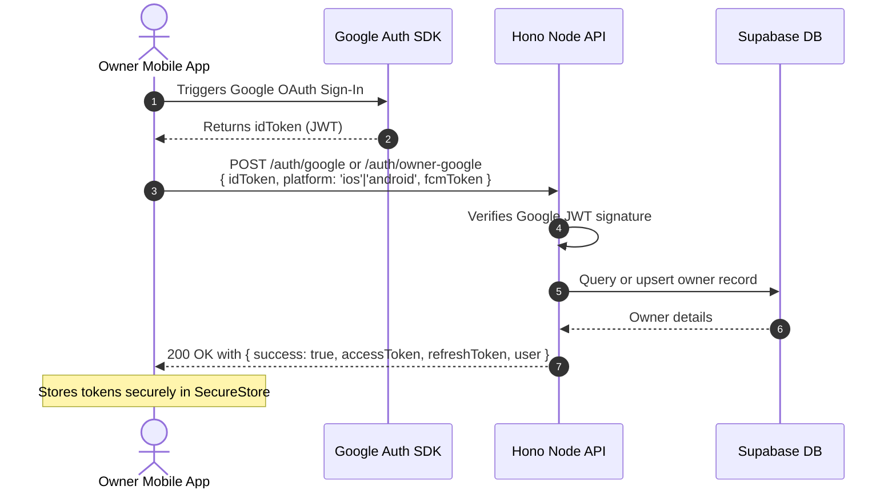

# Mobile Compatibility & Integration Guidelines

This document provides complete architectural patterns, routing maps, state management guides, authentication lifecycles, and development instructions for connecting the native mobile application (built with Expo React Native) to the shared Hono API backend.

---

## 1. Expo & React Native Runtime Architecture

The primary client interface for owners is the native mobile application located in the `/mobile` directory. It is built using **Expo SDK** and **React Native**, designed for cross-platform deployment to iOS and Android.

### 1.1 Codebase Structure
The mobile app is organized as follows:
- **`mobile/app/`**: Expo Router file-based navigation (tabs, stacks, modals).
- **`mobile/components/`**: Custom, reusable UI elements built using React Native primitive components (View, Text, Pressable).
- **`mobile/constants/`**: Design system parameters (Colors, Spacing, Typography).
- **`mobile/lib/`**: Business logic, API clients, and hooks.
  - `api.ts`: Shared Axios/fetch client wrapper with interceptors for bearer authentication and token renewal.
  - `auth.ts`: Google Sign-In helper functions and token exchange handlers.
  - `rentalOps.ts`: Comprehensive set of API caller utility functions covering facilities, rooms, leases, and invoices.
- **`mobile/store/`**: Lightweight client-state management utilizing Zustand stores (`useAuthStore`, `useFacilityStore`, `useWalletStore`).

### 1.2 Router Navigation Map
Expo Router uses file-system-based routing:
- **`app/(tabs)/`**: The persistent bottom tab bar.
  - `index.tsx`: Landlord main premium dashboard (Phòng Trọ & Kinh Doanh).
  - `invoices.tsx`: Invoice management with monthly filtering controls.
  - `finance.tsx`: Cash flow journal and transaction ledger (Sổ quỹ).
  - `profile.tsx`: Owner profile and settings page.
- **`app/facility/[id].tsx`**: Detailed view of a boarding house (Dãy trọ) showing room layout and statistics.
- **`app/room/[id].tsx`**: Room details drawer equivalent, displaying current contracts, meter logs, and quick actions.
- **`app/contract/`**: Contract-related pages (`new.tsx` for creation, `[id].tsx` for details).
- **`app/payment/new.tsx`**: Payment collection form supporting automatic outstanding invoice search.
- **`app/login/`**: Authentication entrypoints (`owner.tsx` for owner Google OAuth, `tenant.tsx` for tenant portals).

---

## 2. Authentication Flow & JWT Token Lifecycle

Unlike the web portal, which secures sessions using HTTP-only cookies, the mobile app uses **Header-based Bearer JWT authentication** to support cross-domain mobile clients.



### 2.1 Secure Storage
- **Access Token**: Stored in standard application memory (or SecureStore). Attached to all requests in the authorization header:
  ```http
  Authorization: Bearer <accessToken>
  ```
- **Refresh Token**: Persistent UUID token stored securely via `Expo.SecureStore` (iOS Keychain / Android EncryptedSharedPreferences). Used to request new access tokens.

### 2.2 Silent Re-Authentication & Refresh Interceptor
When a request fails with a `401 Unauthorized` status, the Axios interceptor intercepts the failure, requests a new access token, and retries the original request:

```typescript
import axios from 'axios';
import * as SecureStore from 'expo-secure-store';

const apiClient = axios.create({
  baseURL: process.env.EXPO_PUBLIC_API_URL,
});

apiClient.interceptors.response.use(
  (response) => response,
  async (error) => {
    const originalRequest = error.config;
    if (error.response?.status === 401 && !originalRequest._retry) {
      originalRequest._retry = true;
      try {
        const refreshToken = await SecureStore.getItemAsync('refreshToken');
        const res = await axios.post(`${process.env.EXPO_PUBLIC_API_URL}/auth/refresh`, {
          refreshToken,
        });
        const { accessToken } = res.data;
        await SecureStore.setItemAsync('accessToken', accessToken);
        originalRequest.headers['Authorization'] = `Bearer ${accessToken}`;
        return apiClient(originalRequest);
      } catch (refreshError) {
        // Refresh token is invalid/expired; clear session and redirect to login
        await SecureStore.deleteItemAsync('refreshToken');
        await SecureStore.deleteItemAsync('accessToken');
        // Trigger global log out redirection...
        return Promise.reject(refreshError);
      }
    }
    return Promise.reject(error);
  }
);
```

---

## 3. Push Notifications & Firebase Cloud Messaging (FCM)

Push notifications are supported natively through **Firebase Cloud Messaging (FCM)** using `expo-notifications`.

- **Token Registration**: During app startup or successful authentication, the mobile client requests notification permissions and obtains the FCM registration token:
  ```http
  POST /me/fcm-token
  Authorization: Bearer <accessToken>
  Content-Type: application/json
  {
    "fcmToken": "fcm-registration-token-string"
  }
  ```
- **Token Invalidation**: To prevent sending notifications to logged-out users, the client must pass the registration token when logging out:
  ```http
  POST /auth/logout
  Content-Type: application/json
  {
    "fcmToken": "fcm-registration-token-string"
  }
  ```

---

## 4. Emulator & Local Development Setup

To test the mobile app against a local Hono backend API, follow these guidelines to establish network connectivity.

### 4.1 Local API Endpoints Addressing
Emulators run in isolated virtual networks and cannot connect directly to standard `localhost` or `127.0.0.1`.
- **Android Emulator**: Resolves host workstation via IP `10.0.2.2`.
- **iOS Simulator**: Resolves host workstation via standard `localhost`.
- **Physical Device**: Must use your computer's local network IP address (e.g., `192.168.1.50`).

### 4.2 Configuration File (`mobile/.env`)
Create a `.env` file inside the `mobile/` directory:
```env
# Change to http://localhost:8787 for iOS development
EXPO_PUBLIC_API_URL=http://10.0.2.2:8787
```

### 4.3 Running Environment Command Logs
1. **Launch Android Emulator**:
   ```bash
   ~/Library/Android/sdk/emulator/emulator -avd Pixel_7a
   ```
2. **Launch Hono Backend (with mock mode or Supabase DB)**:
   ```bash
   cd backend && npm run dev
   ```
3. **Launch Expo Packager**:
   ```bash
   cd mobile && npm run android
   ```
