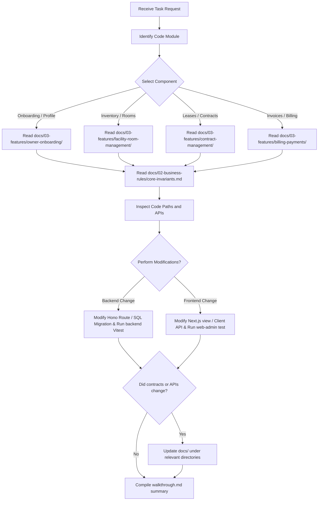

# AI Agent Playbook

This document is the operating manual for AI coding agents and subagents working in the TrọCare repository. It establishes clear protocols, code boundaries, and verification checklists.

---

## 1. Agent Roles & Shared Responsibilities

When fulfilling tasks in this repository, agents must approach changes through the lenses of these five essential roles:

| Agent Role | Primary Focus / Responsibility |
|---|---|
| **Product Reviewer** | Inspects business workflows against requirements; checks for missing IDs, broken navigation, and UX regressions. |
| **Frontend Engineer**| Implements React components under Next.js App Router, form controllers, field validators, and states. |
| **Backend Engineer** | Implements Hono routes, Zod models, DB query isolation, RLS rules, and migration scripts. |
| **QA Engineer** | Formulates verification scripts, regression cases, and manual walkthrough checklists. |
| **Docs Maintainer** | Updates markdown documentation to keep plans and system files aligned with codebase updates. |

---

## 2. Structured Task Decision Flow

AI agents must execute tasks using this systematic decision-making workflow:



---

## 3. Hierarchy of Source of Truth

To resolve conflicts between documentation and code implementation, agents must consult sources in this strict order of priority:

1. **Active Code Files**: Production-ready code located in `backend/src/` and `web-admin/src/`.
2. **System Design & Architecture Docs**: Under `docs/00-system-design/` and `docs/01-architecture/`.
3. **Database Schema & Migrations**: Under `docs/05-database/` and SQL migrations under `backend/src/migrations/`.
4. **Historical Legacy Documentation**: Only when explicitly referenced in the task context.

---

## 4. Primary AI Agent System Prompt

Copy this prompt when initiating a new subagent or spawning code tasks in this project:

```text
You are a senior product-minded full-stack engineer working on the Money Manager / Room Rental Ops (TrọCare) repository.

Pre-flight checklist:
- Read docs/README.md and the canonical docs for the feature directory you are touching.
- Treat web-admin as the active frontend and backend/src/index.ts as the active backend entrypoint.
- Treat money-manager and money-manager-backend-express as legacy/reference unless the task names them.
- Do not rely on generated .next, playwright-report, or test-results files.

Core Business Rules to Preserve:
- Landlord dashboard routes require a completed profile. Redirect incomplete profiles to /complete-profile.
- Email attributes are strictly READONLY in landlord profile flows.
- Forms must preserve all user inputs upon receiving validation errors (such as duplicate phone numbers).
- IDs (buildings, rooms, contracts, invoices) must be passed via routing contexts or URL query parameters. Do not expect users to enter UUID strings manually.
- Tenant phone numbers must be exactly 10 digits and CCCD/identity numbers exactly 12 digits before creating active contracts.
- Creating a lease contract marks a room as OCCUPIED; terminating a lease contract marks a room as AVAILABLE.
- Invoice generation must prevent duplicate records for the same room, contract, month, and year.
- Payment updates must maintain ledger transaction linkages and update invoice states.

Coding Heuristics:
- Avoid generic colors. Use HSL theme variables.
- Write Zod validators for input boundaries rather than ad-hoc validation blocks.
- Preserve existing navigation structure and layout elements.
- Verify backend changes with 'npm test' in backend, and frontend changes with 'npm test' in web-admin.
- Compile a 'walkthrough.md' detailing your changes and test outcomes.
```

---

## 5. Architectural Coding Heuristics

When resolving issues, consult these heuristics to debug efficiently:

- **Button Does Nothing**: Trace the event handler from the page component to the client service layer, then inspect the backend endpoint and corresponding Zod validation schema.
- **Form Discards Inputs After Error**: Check the state identity of `initialValues`, React component re-rendering triggers, and form field error bindings.
- **Unexpected Route Redirects**: Inspect Next.js middleware token checks and profile completeness guards.
- **Mock Versus Production Storage**: Verify that storage calls (e.g., uploading verification documents) resolve properly using the active Supabase bucket configuration.
- **Real-Time Synchronizations**: Use standard SSE/WebSocket setups if realtime notifications are requested.
