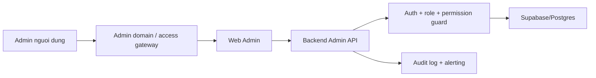

# TroCare Admin Portal - Research Bao Ve Truy Cap

**Ngay cap nhat:** 2026-05-22
**Muc tieu:** Chot cach bao ve Admin Portal truoc khi tiep tuc UI.
**Pham vi:** Web Admin, Backend Admin API, Supabase/Postgres va lop trien khai production.

## 1. Ket Luan Nhanh

Admin Portal khong duoc coi la an toan chi vi:

- URL khong nam trong menu public.
- Route co ten kho doan.
- UI frontend an nut hoac redirect nguoi dung.

TroCare nen bao ve Admin theo nhieu lop:

1. Backend bat buoc xac thuc va authorize moi API `/admin/*`.
2. Frontend chi render man Admin sau khi xac nhan session va quyen.
3. Permission theo action cho thao tac nhay cam, mac dinh tu choi khi chua co quyen.
4. MFA hoac step-up auth cho tai khoan Admin, bat buoc cho Super Admin truoc production.
5. Production nen dua Admin Portal sau mot lop truy cap noi bo/Zero Trust access proxy hoac it nhat tach subdomain va policy rieng.
6. Moi action quan trong phai co audit log, reason, rate limit va canh bao khi bat thuong.

Day la huong thuong thay o he thong lon: route Admin van co the ton tai tren web, nhung nguoi ngoai khong duoc phep di qua lop identity/access gate va cung khong the goi API neu backend tu choi.

## 2. Pattern Thuong Dung O He Thong Lon

### 2.1 Tach mat phang admin khoi mat phang public

Nen coi Admin Portal la mot mat phang van hanh rieng:

- Domain/subdomain rieng, vi du `admin.trocare.vn`.
- Cookie/session scope, CORS, CSP, logging va alerting rieng neu ha tang cho phep.
- Khong dat link Admin trong public navigation, sitemap public hoac trang marketing.
- Khong de search engine index admin routes.

Tach route khong thay the authorization. No giup giam be mat lo thong tin, de trien khai policy rieng va de dat them lop truy cap ben ngoai app.

### 2.2 Dat lop truy cap truoc ung dung

Voi production, nen uu tien mot access gateway cho Admin:

- Identity-aware proxy / Zero Trust Access.
- Policy theo user/group cong ty, MFA, device posture hoac IP/location neu can.
- Access log cho viec vao Admin Portal truoc khi app xu ly request.

Neu chua co gateway, ban dau van phai dat backend authorization day du. Gateway la defense in depth, khong phai cach thay cho permission trong app.

### 2.3 Xac thuc manh cho tai khoan dac quyen

Tai khoan Admin va Super Admin co blast radius lon hon Owner/Tenant:

- Bat MFA cho Super Admin.
- Uu tien MFA cho tat ca Admin.
- Step-up auth hoac re-auth cho action rat nhay cam: sua role/permission, sua config he thong, export du lieu nhay cam, vo hieu hoa tai khoan quan trong.
- Session nen co timeout va revoke ro rang khi khoa user hoac nghi ngo compromise.

### 2.4 Authorization o server la bat buoc

Moi lop UI chi la trai nghiem nguoi dung:

- UI an menu/nut theo permission.
- Next.js route/layout co the redirect som.
- Backend van phai kiem tra auth va quyen tren tung endpoint/action.
- Permission nen theo rule "deny by default" va "least privilege".

TroCare da co backend guard `requireAuth` + `requireAdmin`. Khi format permission duoc chot, action quan trong nen them permission guard tren backend truoc khi mo UI chinh thuc cho role khac Super Admin.

### 2.5 Database va secret khong duoc bien thanh cua sau

Voi Supabase:

- Bat RLS cho table/view nam trong exposed schema neu frontend/Data API co the truy cap.
- Khong dua `service_role`/secret key vao web client.
- Backend dung quyen cao phai tu authorize truoc khi truy van hoac mutate du lieu thay nguoi dung.
- Views/functions dac quyen phai review ky de tranh vo tinh bypass RLS.

Trong TroCare, Admin API dang dung backend de thao tac du lieu quan tri. Dieu do chap nhan duoc chi khi token/role/permission duoc check o backend va secret chi nam server-side.

## 3. Mo Hinh De Xuat Cho TroCare

### 3.1 Lop bao ve toi thieu truoc khi lam UI rong

| Lop | Trang thai hien tai | Can chot |
|---|---|---|
| Admin API auth | Da co `requireAuth` | Giu bat buoc cho moi `/admin/*` |
| Admin role guard | Da co `requireAdmin`, `requireSuperAdmin` | Giu role guard cho den khi permission matrix chot |
| Permission matrix | DB va endpoint doc permission da co mot phan | Chot key/action format roi enforce backend |
| Frontend guard | `web-admin/src/app/admin/layout.tsx` check `/auth/me` va role | Khong coi day la lop bao ve duy nhat |
| Audit log | Da co phase audit API/schema | Bat buoc cho action nhay cam |
| MFA/step-up | Chua thay trong admin flow hien tai | Them vao security backlog truoc production |
| External access gate | Chua co trong repo | Chon gateway/subdomain policy cho production |

### 3.2 Kien truc access de xuat

### 3.3 Rule cho URL Admin

Nen lam:

- Dung route ro rang de van hanh va log, vi du `/admin`.
- Khong public link route Admin trong UI public.
- Neu production co domain rieng thi public app khong can biet domain admin.
- Dat `noindex` cho Admin pages.

Khong nen lam:

- Dua vao URL bi mat lam security control.
- Dung frontend redirect de thay cho backend auth.
- De Owner/Tenant API token goi duoc Admin API vi endpoint thieu guard.

## 4. Permission Va UI Sau Khi Format Duoc Chot

Tai lieu nghiep vu hien tai dang de xuat key dang `module.action`, vi du:

- `owner.view`
- `owner.lock`
- `invoice.mark_paid`
- `role.update`
- `system_config.update`

Khi chot format, nen map moi man UI theo 3 muc:

| Muc | Cach dung |
|---|---|
| Route permission | Co duoc mo module/list/detail khong |
| Action permission | Co duoc tao/sua/khoa/huy/export khong |
| Sensitive field permission | Co duoc xem field nhay cam khong |

UI can:

- An menu khi khong co route permission.
- Disable/an action khi khong co action permission.
- Hien loi 403 than thien neu API tu choi.
- Khong render sensitive data neu API khong tra ve.

Backend can:

- Kiem tra permission truoc mutate.
- Khong tin permission frontend gui len.
- Ghi audit log cho action high risk.
- Yeu cau `reason` cho action da duoc danh dau nhay cam trong spec.

## 5. Checklist Truoc Khi UI Admin Mo Rong

### Bat buoc truoc UI phase lon

- Tat ca endpoint Admin moi co auth + admin guard.
- Response 401/403 duoc test.
- Admin layout khong public data truoc khi auth check xong.
- Khong co `service_role` key trong web client/env public.
- Schema/admin API tra du lieu dung expected cho module dang lam.
- Audit log duoc xac dinh cho action nhay cam.

### Bat buoc truoc production

- Chot permission matrix va enforce backend.
- Bat MFA cho Super Admin; co plan cho Admin con lai.
- Chon lop access cho Admin Portal: Zero Trust/access proxy hoac chinh sach noi bo tuong duong.
- Chot session timeout, revoke session, brute-force/rate-limit va alerting.
- Review RLS/Data API exposure cho table/view Supabase lien quan.
- Co test regression cho unauthorized, wrong role, missing permission va audit log.

## 6. Huong UI Tu Tai Lieu Nay

Khi bat dau UI:

1. Dung sitemap va module spec trong `trocare-admin-portal.md`.
2. Dung phase ordering trong `trocare-admin-implementation-plan.md`.
3. Dung design tokens/components san co trong `web-admin/src/components/ui`.
4. Moi screen phai bam `admin-permission-contract.md` truoc khi build action bar va dangerous action modal.
5. Lam dashboard/list/detail theo API da verify; khong chen du lieu gia de che loi auth/permission.

## 7. Nguon Research

- OWASP Authorization Cheat Sheet: default deny, least privilege, authorization logic theo business context.
- OWASP Multifactor Authentication Cheat Sheet: MFA cho administrative/high-privilege users.
- Next.js Authentication Guide: auth checks cho server actions/data access, UI restriction khong du cho security.
- Supabase Securing Your API va API Keys docs: RLS cho Data API/exposed tables va khong expose `service_role`.
- Cloudflare Zero Trust Access docs: internal applications nen co access policy/gateway rieng.
