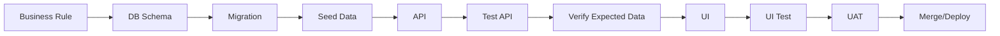

# TroCare Admin Portal — Implementation Plan theo từng Phase

**Phiên bản:** 1.0
**Vai trò tài liệu:** Senior BA / PM / Delivery Plan
**Phạm vi:** Lên kế hoạch triển khai Admin Portal TroCare theo từng phase, từ DB → API → Test → Verify Data → UI → UAT
**Hiện trạng đã có:** Admin đã login bằng tài khoản, xem được danh sách/số lượng tài khoản, khóa/active tài khoản cơ bản.

---

## 0. Mục tiêu tài liệu

Tài liệu này dùng để hướng dẫn team triển khai Admin Portal theo thứ tự đúng, tránh làm UI trước rồi phát hiện thiếu DB/API/permission/audit.

Mỗi phase phải đi theo nguyên tắc:

```text
1. Chốt nghiệp vụ
2. Chốt DB schema
3. Viết migration
4. Seed/mock data
5. Viết API
6. Test API
7. So sánh dữ liệu API với DB/expected
8. Viết UI
9. Connect UI vá»›i API
10. Test UI
11. Test permission
12. Test audit log
13. UAT
14. Fix bug
15. Merge/deploy
```

---

## 1. Nguyên tắc triển khai chung

### 1.1 Không làm UI trước khi API và dữ liệu chưa đúng

Admin Portal phụ thuộc rất nhiều vào:

- Trạng thái tài khoản.
- Quyền Admin.
- Dữ liệu liên kết Owner → Cơ sở → Phòng → Khách thuê → Hợp đồng → Hóa đơn.
- Audit log.
- Filter, count, aggregate.

Vì vậy mỗi module phải đi theo flow:



### 1.2 Checklist bắt buộc trước khi qua phase tiếp theo

Một phase chỉ được xem là xong khi pass checklist:

```text
- DB migration chạy thành công
- Seed/mock data đủ case
- API chạy được
- API có permission guard nếu cần
- API test bằng Postman/Swagger pass
- Response API so sánh với DB đúng
- Action nguy hiểm có modal/reason nếu có UI
- Audit log ghi đúng nếu action quan trọng
- UI connect API thật
- UI có loading/empty/error state
- QA test case pass
- Không còn bug blocker
```

### 1.3 Definition of Done cho từng module

Một module Admin được xem là hoàn thành khi có đủ:

```text
- List screen
- Detail screen nếu module cần detail
- Search/filter/sort/pagination
- Create/update/action theo quyền
- Permission guard ở backend
- Permission rendering ở frontend
- Modal xác nhận cho action nguy hiểm
- Audit log cho action quan trọng
- Validation dữ liệu
- API test pass
- UI test pass
- UAT pass
```

---

## 2. Roadmap tổng thể

```text
Phase 0: Audit hiện trạng Admin hiện tại
Phase 1: Chuẩn hóa Account Status + Lock/Unlock
Phase 2: Audit Log nền tảng
Phase 3: Role & Permission
Phase 4: Owner Management
Phase 5: Tenant Management
Phase 6: Property & Room Management
Phase 7: Contract Management
Phase 8: Invoice / Payment Management
Phase 9: Dashboard nâng cấp
Phase 10: Reports vận hành
Phase 11: System Config
Phase 12: System Notification
Phase 13: Hardening, QA Regression, Deploy
```

---

## Security Gate Truoc UI Admin

Truoc khi mo rong UI Admin, team phai bam theo checklist trong `admin-access-security-research.md`.
Permission key va API/UI mapping dung contract trong `admin-permission-contract.md`.

```text
- URL /admin khong phai lop bao mat chinh
- UI an route/nut khong thay the backend authorization
- Moi Admin API moi phai co auth + admin guard
- Action nhay cam can permission, reason va audit log khi format permission da chot
- Production can chot MFA cho tai khoan dac quyen va lop truy cap rieng cho Admin Portal
```

# Phase 0 — Audit hiện trạng Admin hiện tại

## 0.1 Mục tiêu

Xác định hệ thống hiện tại có gì, thiếu gì, reuse được gì.

Hiện tại đã có:

```text
- Admin login bằng tài khoản
- Xem số lượng tài khoản
- Xem danh sách tài khoản
- Khóa / active tài khoản
```

Phase này không code tính năng mới lớn, chỉ review và ghi nhận hiện trạng.

---

## 0.2 Việc cần làm

### A. Review DB hiện tại

Kiểm tra các bảng hiện có:

```text
users
accounts
admins
roles
permissions
owners
tenants
sessions
```

Cần trả lời:

```text
- Admin và Owner dùng chung bảng users không?
- Có user_type không?
- Có status không?
- Khóa tài khoản đang dùng field gì?
- Active tài khoản đang dùng field gì?
- Có last_login_at chưa?
- Có locked_at, locked_by, locked_reason chưa?
- Có audit_logs chưa?
- Có role/permission chưa?
```

### B. Review API hiện tại

Liệt kê API đang có:

```text
POST /login
GET /admin/accounts
GET /admin/accounts/summary
POST /admin/accounts/{id}/lock
POST /admin/accounts/{id}/active
```

Cần kiểm tra:

```text
- API có kiểm tra role Admin chưa?
- API có phân biệt Owner/Tenant/Admin chưa?
- API lock có yêu cầu reason không?
- API active có audit log không?
- API list account có filter không?
- API có pagination không?
```

### C. Review UI hiện tại

Kiểm tra màn hình:

```text
- Login Admin
- Account List
- Account Summary
- Button khóa/active
```

Cần kiểm tra:

```text
- Có filter/search chưa?
- Có status badge chưa?
- Có modal reason chưa?
- Có loading/empty/error chưa?
- Có phân quyền button chưa?
```

---

## 0.3 Output cần có

Tạo tài liệu review nội bộ:

```text
admin-current-state.md
```

Ná»™i dung:

```text
1. DB hiện tại
2. API hiện tại
3. UI hiện tại
4. Tính năng reuse được
5. Tính năng cần refactor
6. Rủi ro hiện tại
7. Đề xuất nâng cấp
```

---

## 0.4 Done Criteria

```text
- Biết rõ account hiện tại lưu ở bảng nào
- Biết lock/active hiện tại xử lý bằng field nào
- Biết có cần migrate status không
- Biết API hiện tại reuse được bao nhiêu %
- Biết UI cần chỉnh gì
- Có file admin-current-state.md
```

---

# Phase 1 — Chuẩn hóa Account Status + Lock/Unlock

## 1.1 Mục tiêu

Chuẩn hóa phần Admin hiện tại đã có: login, list account, khóa/active tài khoản.

Không mở rộng Owner/Tenant ngay. Làm chắc account status trước.

---

## 1.2 Business Rules

### Status chuẩn

Dùng một field chính:

```text
status
```

Giá trị:

```text
pending_activation
active
locked
soft_deleted
```

Không dùng lẫn lộn nhiều field như:

```text
is_active
is_locked
status
```

### Login rule

```text
status = active             → được login
status = pending_activation → chưa được login hoặc cần kích hoạt
status = locked             → không được login
status = soft_deleted       → không được login
```

### Lock rule

```text
- Admin phải có quyền lock account
- Bắt buộc nhập lý do
- status chuyển sang locked
- LÆ°u locked_at
- LÆ°u locked_by
- LÆ°u locked_reason
- Revoke session hiện tại của user nếu đang login
- Ghi audit log
```

### Unlock rule

```text
- Admin phải có quyền unlock account
- Bắt buộc nhập lý do
- status chuyển sang active
- Có thể lưu unlocked_at/unlocked_by/unlocked_reason nếu cần
- Ghi audit log
```

---

## 1.3 DB cần làm

Nếu đang dùng bảng `users`, thêm/chỉnh:

```sql
status varchar(30) not null default 'active';
last_login_at timestamp null;
locked_at timestamp null;
locked_by uuid null;
locked_reason text null;
deleted_at timestamp null;
created_at timestamp not null;
updated_at timestamp not null;
```

Index cần có:

```sql
index users_status_idx(status);
index users_user_type_idx(user_type);
index users_created_at_idx(created_at);
index users_last_login_at_idx(last_login_at);
```

Nếu đã có `is_active`, `is_locked`, migration cần backfill:

```text
is_locked = true                            → status = locked
is_active = true and is_locked = false      → status = active
is_active = false and is_locked = false     → status = pending_activation hoặc soft_deleted tùy dữ liệu
```

---

## 1.4 Migration

Tạo migration:

```text
YYYYMMDDHHMM_update_user_status_fields
```

Migration gồm:

```text
- Add status nếu chưa có
- Add last_login_at
- Add locked_at
- Add locked_by
- Add locked_reason
- Add deleted_at nếu chưa có
- Backfill dữ liệu cũ
- Add indexes
```

---

## 1.5 Seed data

Tạo seed đủ case:

```text
Super Admin active
Operation Admin active
Read-only Admin active
Owner active
Owner locked
Owner pending_activation
Tenant active
Tenant locked
Tenant pending_activation
```

---

## 1.6 API cần có

```text
POST /admin/auth/login
POST /admin/auth/logout
GET  /admin/accounts
GET  /admin/accounts/summary
POST /admin/accounts/{id}/lock
POST /admin/accounts/{id}/unlock
```

### Query cho GET /admin/accounts

```text
keyword
type = admin | owner | tenant
status = pending_activation | active | locked | soft_deleted
created_from
created_to
last_login_from
last_login_to
page
limit
sort_by
sort_order
```

### Body lock

```json
{
  "reason": "Tài khoản vi phạm quy định sử dụng"
}
```

### Body unlock

```json
{
  "reason": "Đã kiểm tra và cho phép sử dụng lại"
}
```

---

## 1.7 Test API

Test bằng Postman/Swagger.

### Login

```text
1. Admin active login → success
2. Admin locked login → fail
3. Owner locked login → fail
4. Tenant locked login → fail
5. Login thành công cập nhật last_login_at
```

### Account List

```text
1. GET accounts không filter → trả đúng total
2. Filter status=locked → chỉ locked
3. Filter type=owner → chỉ owner
4. Search email → đúng record
5. Pagination page/limit đúng
```

### Lock/Unlock

```text
1. Lock account không reason → fail
2. Lock account có reason → success
3. Sau lock, status = locked
4. User bị locked login lại → fail
5. Unlock không reason → fail
6. Unlock có reason → success
7. Sau unlock, status = active
```

---

## 1.8 Verify dữ liệu expected

Sau lock, check DB:

```text
status = locked
locked_reason có dữ liệu
locked_by = admin_id
locked_at != null
```

Sau unlock:

```text
status = active
```

Nếu đã có audit log phase 2 thì check:

```text
action = account.lock / account.unlock
object_id = account_id
reason đúng
before/after đúng
```

Nếu phase 2 chưa làm audit log, tạo placeholder service để phase 2 gắn vào.

---

## 1.9 UI cần làm

Cập nhật màn hình account hiện tại:

```text
- Status badge
- Filter status
- Filter type
- Search tên/email/phone
- Pagination
- Modal khóa có reason
- Modal mở khóa có reason
- Loading state
- Empty state
- Error state
```

---

## 1.10 Done Criteria

```text
- Login respect status
- Account list filter đúng
- Lock/unlock bắt buộc reason
- DB update đúng
- API test pass
- UI thao tác đúng
- Không phát sinh bug blocker
```

---

# Phase 2 — Audit Log nền tảng

## 2.1 Mục tiêu

Ghi nhận mọi hành động quan trọng. Phase này nên làm sớm vì các phase sau càng nhiều action nguy hiểm.

---

## 2.2 Business Rules

Audit Log phải trả lời được:

```text
Ai làm?
Làm hành động gì?
Làm trên module nào?
Tác động object nào?
Giá trị trước/sau là gì?
Lý do là gì?
IP/user agent nào?
Thời điểm nào?
```

Audit log không được sửa/xóa từ UI.

---

## 2.3 DB

Tạo bảng:

```text
audit_logs
```

Fields:

```text
id
actor_id
actor_name
actor_role
module
action
object_type
object_id
before_value json
after_value json
reason text
risk_level
ip_address
user_agent
created_at
```

Index:

```text
actor_id
module
action
object_type
object_id
risk_level
created_at
```

---

## 2.4 Migration

```text
YYYYMMDDHHMM_create_audit_logs_table
```

---

## 2.5 Service

Tạo service dùng chung:

```text
AuditLogService.create({
  actor,
  module,
  action,
  objectType,
  objectId,
  beforeValue,
  afterValue,
  reason,
  riskLevel,
  requestMeta
})
```

Không ghi audit log rải rác trong từng controller. Controller gọi service.

---

## 2.6 Gắn audit vào action hiện tại

Gắn cho:

```text
admin.login.success
admin.login.failed
admin.logout
account.lock
account.unlock
account.update
```

Risk level:

```text
login.success = low
login.failed = medium
account.update = medium
account.lock = high
account.unlock = high
```

---

## 2.7 API

```text
GET /admin/audit-logs
GET /admin/audit-logs/{id}
```

Query:

```text
actor_id
module
action
risk_level
object_type
object_id
created_from
created_to
page
limit
```

---

## 2.8 Test API

```text
1. Lock account → tạo audit log account.lock
2. Unlock account → tạo audit log account.unlock
3. Login failed → tạo audit log admin.login.failed
4. GET audit logs filter module=account → đúng
5. GET audit log detail → có before/after/reason
6. Audit log không có API update/delete
```

---

## 2.9 Verify expected

Ví dụ lock account phải có log:

```json
{
  "module": "account",
  "action": "account.lock",
  "object_type": "user",
  "object_id": "USER_ID",
  "before_value": {
    "status": "active"
  },
  "after_value": {
    "status": "locked"
  },
  "reason": "Tài khoản vi phạm quy định",
  "risk_level": "high"
}
```

---

## 2.10 UI

Màn hình Audit Log:

```text
- Table logs
- Filter actor/module/action/risk/time
- Detail drawer/modal
- Hiển thị before/after JSON
- Không có edit/delete action
```

---

## 2.11 Done Criteria

```text
- Audit log table có dữ liệu đúng
- Lock/unlock/login ghi log
- API audit trả đúng
- UI xem được log
- Log không sửa/xóa được từ UI
```

---

# Phase 3 — Role & Permission

## 3.1 Mục tiêu

Không để tất cả Admin có toàn quyền. Kiểm soát menu, button và API theo permission.

---

## 3.2 Role MVP

```text
Super Admin
Operation Admin
Read-only Admin
```

Role mở rộng sau:

```text
Finance Admin
Support Admin
```

---

## 3.3 Permission MVP

```text
account.view
account.lock
account.unlock

owner.view
owner.update
owner.lock
owner.unlock

tenant.view
tenant.update
tenant.lock
tenant.unlock
tenant.view_sensitive

audit_log.view

admin_user.view
admin_user.create
admin_user.update
admin_user.lock

role.view
role.update
role.assign
```

Sau này mở rộng:

```text
property.view/update/lock/unlock
room.view/update
contract.view/update/cancel/download_file
invoice.view/update/mark_paid/cancel
report.view/export
system_config.view/update
notification.view/create/send/cancel
```

---

## 3.4 DB

Bảng:

```text
roles
permissions
role_permissions
```

Nếu Admin đang nằm trong users:

```text
users.role_id
```

Nếu có bảng riêng:

```text
admin_users.role_id
```

MVP khuyến nghị:

```text
1 Admin = 1 role
```

---

## 3.5 Migration

```text
create_roles_table
create_permissions_table
create_role_permissions_table
add_role_id_to_admin_users_or_users
```

---

## 3.6 Seed

Seed roles:

```text
Super Admin
Operation Admin
Read-only Admin
```

Seed permissions và map:

```text
Super Admin = all permissions
Operation Admin = account.view, owner.view, owner.update, tenant.view...
Read-only Admin = *.view only
```

---

## 3.7 API

```text
GET /admin/me/permissions

GET /admin/admin-users
POST /admin/admin-users
PATCH /admin/admin-users/{id}
POST /admin/admin-users/{id}/lock
POST /admin/admin-users/{id}/unlock

GET /admin/roles
GET /admin/roles/{id}
PATCH /admin/roles/{id}/permissions
POST /admin/admin-users/{id}/assign-role
```

---

## 3.8 Backend Guard

Mỗi API cần permission guard.

Ví dụ:

```text
POST /admin/accounts/{id}/lock requires account.lock
GET /admin/audit-logs requires audit_log.view
PATCH /admin/roles/{id}/permissions requires role.update
```

Không chỉ ẩn button ở UI.

---

## 3.9 Test API

```text
1. Super Admin gọi lock account → success
2. Read-only Admin gọi lock account → 403
3. Operation Admin xem account list → success
4. User không phải Admin gọi admin API → 403
5. Sửa role permission → ghi audit log critical
6. Không cho khóa/xóa Super Admin cuối cùng
```

---

## 3.10 UI

```text
- Menu render theo permission
- Button action render theo permission
- Admin User List
- Create Admin
- Assign Role
- Role List
- Role Detail
- Permission Matrix
```

---

## 3.11 Done Criteria

```text
- API guard hoạt động
- UI menu/action theo quyền
- Role matrix sửa được
- Không làm mất Super Admin cuối cùng
- Audit log ghi khi sá»­a role
```

---

# Phase 4 — Owner Management

## 4.1 Mục tiêu

Tách Owner khỏi màn hình account chung. Owner là trung tâm nghiệp vụ.

---

## 4.2 DB Review

Cần xác định mô hình:

### Cách A — khuyến nghị

```text
users: login/account
owners: owner profile/business data
owners.user_id → users.id
```

### Cách B

```text
users.user_type = owner
```

Nếu hệ thống sẽ lớn, nên dùng Cách A.

---

## 4.3 API Owner List

```text
GET /admin/owners
```

Query:

```text
keyword
status
created_from
created_to
last_login_from
last_login_to
page
limit
sort_by
sort_order
```

Response cần có aggregate:

```text
property_count
room_count
tenant_count
active_contract_count
unpaid_invoice_count
```

---

## 4.4 API Owner Detail

```text
GET /admin/owners/{id}
GET /admin/owners/{id}/properties
GET /admin/owners/{id}/rooms
GET /admin/owners/{id}/tenants
GET /admin/owners/{id}/contracts
GET /admin/owners/{id}/invoices
GET /admin/owners/{id}/audit-logs
POST /admin/owners/{id}/notes
```

---

## 4.5 API Lock/Unlock Owner

Có thể dùng account lock chung, nhưng nên expose rõ:

```text
POST /admin/owners/{id}/lock
POST /admin/owners/{id}/unlock
```

Body:

```json
{
  "reason": "Owner vi phạm quy định sử dụng"
}
```

---

## 4.6 Test API

```text
1. Owner list total đúng
2. Filter owner status active/locked đúng
3. Search email/phone đúng
4. property_count đúng
5. room_count đúng
6. tenant_count đúng
7. Owner detail trả đúng thông tin
8. Owner tabs trả đúng dữ liệu liên quan
9. Lock/unlock Owner ghi audit log
```

---

## 4.7 Verify expected bằng DB

Ví dụ kiểm tra aggregate:

```sql
select count(*) from properties where owner_id = 'OWNER_ID';
select count(*) from rooms where owner_id = 'OWNER_ID';
select count(*) from tenants where owner_id = 'OWNER_ID';
```

So vá»›i response:

```json
{
  "property_count": 3,
  "room_count": 45,
  "tenant_count": 38
}
```

Phải khớp.

---

## 4.8 UI

Màn hình:

```text
Owner List
Owner Detail
Owner Detail Tabs
Lock/Unlock Owner Modal
Internal Notes
```

Owner Detail tabs:

```text
Tổng quan
Hồ sơ
Cơ sở
Phòng
Khách thuê
Hợp đồng
Hóa đơn
Ghi chú nội bộ
Nhật ký hoạt động
```

---

## 4.9 Done Criteria

```text
- Owner list đúng data
- Owner detail đủ tabs
- Aggregate count so vá»›i DB khá»›p
- Lock/unlock Owner dùng flow chuẩn
- Audit log hoạt động
- UI filter/search/pagination đầy đủ
```

---

# Phase 5 — Tenant Management

## 5.1 Mục tiêu

Admin quản lý khách thuê cấp hệ thống.

---

## 5.2 DB Review

Cần xác định:

```text
tenants có owner_id không?
tenants có user_id không nếu tenant login app?
tenants có current_room_id không?
contracts liên kết tenant_id thế nào?
invoices liên kết tenant_id thế nào?
Công nợ tenant tính từ đâu?
```

---

## 5.3 API

```text
GET /admin/tenants
GET /admin/tenants/{id}
GET /admin/tenants/{id}/contracts
GET /admin/tenants/{id}/invoices
GET /admin/tenants/{id}/rental-history
POST /admin/tenants/{id}/lock
POST /admin/tenants/{id}/unlock
GET /admin/tenants/{id}/sensitive
```

Query list:

```text
keyword
owner_id
property_id
room_id
rental_status
account_status
has_debt
page
limit
sort_by
sort_order
```

---

## 5.4 Test API

```text
1. List tenant filter owner_id đúng
2. List tenant filter room_id đúng
3. Detail tenant trả current room đúng
4. Debt amount đúng với unpaid invoices
5. Admin không có tenant.view_sensitive gọi sensitive API → 403
6. Admin có tenant.view_sensitive gọi sensitive API → success
7. Gọi sensitive API ghi audit log High
8. Lock/unlock tenant bắt buộc reason
```

---

## 5.5 Verify expected

Debt expected:

```text
debt_amount = sum(total_amount - paid_amount)
              where invoice.status in unpaid, partial_paid, overdue
              and tenant_id = current tenant
```

So sánh API với DB/calculation.

---

## 5.6 UI

```text
Tenant List
Tenant Detail
Sensitive Data Masking
Lock/Unlock Tenant Modal
```

Tenant Detail tabs:

```text
Tổng quan
Hồ sơ
Lịch sử thuê
Hợp đồng
Hóa đơn
Công nợ
Nhật ký hoạt động
```

---

## 5.7 Done Criteria

```text
- Tenant list/detail đúng dữ liệu
- Filter theo Owner/cơ sở/phòng đúng
- Debt calculation đúng
- Sensitive permission đúng
- Sensitive access ghi audit log
- Lock/unlock tenant đúng
```

---

# Phase 6 — Property & Room Management

## 6.1 Mục tiêu

Admin xem và kiểm soát cơ sở/phòng toàn hệ thống.

---

## 6.2 API Property

```text
GET /admin/properties
GET /admin/properties/{id}
GET /admin/properties/{id}/rooms
GET /admin/properties/{id}/tenants
GET /admin/properties/{id}/contracts
GET /admin/properties/{id}/invoices
POST /admin/properties/{id}/lock
POST /admin/properties/{id}/unlock
```

Query:

```text
keyword
owner_id
province
district
status
page
limit
sort_by
sort_order
```

---

## 6.3 API Room

```text
GET /admin/rooms
GET /admin/rooms/{id}
GET /admin/rooms/{id}/rental-history
GET /admin/rooms/{id}/invoices
PATCH /admin/rooms/{id}
```

Query:

```text
keyword
owner_id
property_id
status
price_from
price_to
page
limit
sort_by
sort_order
```

---

## 6.4 Business Rules

### Khóa cơ sở

```text
- Cần property.lock
- Bắt buộc reason
- Owner không được thao tác mới trên cơ sở bị khóa
- Dữ liệu cũ giữ nguyên
- Ghi audit log High
```

### Update trạng thái phòng

```text
- Cần room.update
- Nếu phòng có hợp đồng active, không cho đổi sang vacant trực tiếp
- Mọi thay đổi trạng thái ghi audit log
```

---

## 6.5 Test API

```text
1. Property room_count đúng
2. Property occupied/vacant count đúng
3. Property lock/unlock bắt buộc reason
4. Room current tenant đúng
5. Room current contract đúng
6. Không cho đổi occupied → vacant nếu contract active
7. Room update ghi audit log
```

---

## 6.6 Verify expected

```sql
select count(*) from rooms where property_id = 'PROPERTY_ID';
select count(*) from rooms where property_id = 'PROPERTY_ID' and status = 'occupied';
select count(*) from rooms where property_id = 'PROPERTY_ID' and status = 'vacant';
```

So sánh với API.

---

## 6.7 UI

```text
Property List
Property Detail
Room List
Room Detail
Property Lock/Unlock Modal
Room Status Update
```

---

## 6.8 Done Criteria

```text
- Property/Room API đúng
- Aggregate count đúng
- Lock property đúng rule
- Room status không gây mâu thuẫn
- UI hoạt động đúng
- Audit log đầy đủ
```

---

# Phase 7 — Contract Management

## 7.1 Mục tiêu

Admin xem, kiểm tra và hỗ trợ xử lý hợp đồng.

---

## 7.2 API

```text
GET /admin/contracts
GET /admin/contracts/{id}
PATCH /admin/contracts/{id}
POST /admin/contracts/{id}/cancel
GET /admin/contracts/{id}/file
GET /admin/contracts/{id}/history
```

Query:

```text
keyword
owner_id
property_id
room_id
tenant_id
status
start_from
start_to
end_from
end_to
near_expiry
page
limit
sort_by
sort_order
```

---

## 7.3 Business Rules

### Near expiry

```text
near_expiry = active contract where end_date <= today + config.contract_expiry_warning_days
```

### Sửa hợp đồng

```text
- Cần contract.update
- Bắt buộc reason
- LÆ°u before/after
- Không cho đổi room/tenant gây trùng active contract
- Ghi audit log High
```

### Hủy hợp đồng

```text
- Cần contract.cancel
- Bắt buộc reason
- Không xóa invoice liên quan
- Status = cancelled
- Ghi audit log High/Critical
```

---

## 7.4 Test API

```text
1. Filter contract near_expiry đúng
2. Filter expired đúng
3. Detail contract đúng owner/tenant/room
4. Cancel contract không reason → fail
5. Cancel contract có reason → success
6. Cancel không xóa invoice liên quan
7. Update contract ghi before/after audit log
8. Không cho update tạo trùng active contract
```

---

## 7.5 Verify expected

Near expiry check:

```text
end_date <= today + warning_days
and status = active
```

So sánh API với query DB.

---

## 7.6 UI

```text
Contract List
Contract Detail
Edit Contract Modal/Page
Cancel Contract Modal
Contract History
Download File
```

---

## 7.7 Done Criteria

```text
- Contract list/filter đúng
- Near expiry đúng
- Detail đúng data
- Cancel/edit đúng rule
- Audit log before/after đúng
- UI đủ state
```

---

# Phase 8 — Invoice / Payment Management

## 8.1 Mục tiêu

Admin kiểm soát hóa đơn và thanh toán do Owner tạo.

---

## 8.2 API

```text
GET /admin/invoices
GET /admin/invoices/{id}
PATCH /admin/invoices/{id}
POST /admin/invoices/{id}/mark-paid
POST /admin/invoices/{id}/cancel
GET /admin/invoices/{id}/history
```

Query:

```text
keyword
owner_id
property_id
room_id
tenant_id
status
billing_period
created_from
created_to
paid_from
paid_to
overdue
page
limit
sort_by
sort_order
```

---

## 8.3 Business Rules

### Total amount

```text
total_amount = room_amount
             + electricity_amount
             + water_amount
             + service_amount
             + surcharge_amount
             - discount_amount
```

### Mark paid

```text
- Cần invoice.mark_paid
- Bắt buộc amount
- Bắt buộc paid_at
- Bắt buộc reason nếu Admin thao tác
- paid_amount < total_amount → partial_paid
- paid_amount >= total_amount → paid
- Ghi audit log High
```

### Sá»­a invoice

```text
- Cần invoice.update
- Không sửa paid invoice nếu config không cho phép
- Sửa tiền bắt buộc reason
- LÆ°u before/after
- Ghi audit log High
```

### Hủy invoice

```text
- Cần invoice.cancel
- Bắt buộc reason
- Không hard delete
- Status = cancelled
- Ghi audit log High
```

---

## 8.4 Test API

```text
1. Filter unpaid đúng
2. Filter overdue đúng
3. Invoice total tính đúng
4. Mark paid full → status paid
5. Mark paid partial → status partial_paid
6. Cancel invoice → status cancelled
7. Cancel không xóa record
8. Sửa tiền ghi before/after audit log
9. Không cho sửa paid invoice nếu config false
```

---

## 8.5 Verify expected

Tính total từ DB rồi so với response.

```text
expected_total = room + electricity + water + service + surcharge - discount
```

Debt tenant:

```text
sum(total_amount - paid_amount)
where status in unpaid, partial_paid, overdue
```

---

## 8.6 UI

```text
Invoice List
Invoice Detail
Edit Invoice Modal
Mark Paid Modal
Cancel Invoice Modal
Invoice History
Payment History
```

---

## 8.7 Done Criteria

```text
- Invoice API đúng
- Total/debt calculation đúng
- Mark paid đúng trạng thái
- Cancel không hard delete
- Audit log đầy đủ
- UI hoạt động đúng
```

---

# Phase 9 — Dashboard nâng cấp

## 9.1 Mục tiêu

Nâng Dashboard từ đếm tài khoản thành dashboard vận hành toàn hệ thống.

Chỉ làm phase này sau khi Owner/Tenant/Property/Room/Contract/Invoice API ổn.

---

## 9.2 API

```text
GET /admin/dashboard/summary
GET /admin/dashboard/charts
GET /admin/dashboard/alerts
```

---

## 9.3 Summary cần có

```text
total_owners
active_owners
locked_owners
total_tenants
total_properties
total_rooms
occupied_rooms
vacant_rooms
near_expiry_contracts
unpaid_invoices
overdue_invoices
total_debt_amount
```

---

## 9.4 Charts

```text
Owner mới theo tháng
Trạng thái phòng
Trạng thái hóa đơn
```

---

## 9.5 Alerts

```text
Hợp đồng sắp hết hạn
Hóa đơn quá hạn
Owner không đăng nhập 30 ngày
Phòng trống lâu ngày nếu có dữ liệu
```

---

## 9.6 Test API

```text
1. Tổng Owner đúng
2. Owner active/locked đúng
3. Tổng phòng đúng
4. Phòng occupied/vacant đúng
5. Hợp đồng sắp hết hạn đúng
6. Hóa đơn overdue đúng
7. Tổng công nợ đúng
8. Click dashboard card filter sang list đúng
```

---

## 9.7 Verify expected

So sánh từng chỉ số với SQL/query DB.

Ví dụ:

```sql
select count(*) from users where user_type = 'owner';
select count(*) from rooms where status = 'occupied';
select count(*) from invoices where status = 'overdue';
```

---

## 9.8 UI

```text
Summary Cards
Charts
Alert Lists
Drill-down từ card sang list
Time filter
Owner/property filter nếu cần
```

---

## 9.9 Done Criteria

```text
- Dashboard summary đúng
- Chart đúng
- Alert đúng
- Drill-down đúng filter
- UI đẹp, rõ, không gọi tiền hóa đơn là doanh thu nền tảng
```

---

# Phase 10 — Reports vận hành

## 10.1 Mục tiêu

Tạo báo cáo vận hành cơ bản cho Admin.

---

## 10.2 API

```text
GET /admin/reports/owners
GET /admin/reports/tenants
GET /admin/reports/rooms
GET /admin/reports/contracts
GET /admin/reports/invoices
GET /admin/reports/system-activities
```

Query chung:

```text
from_date
to_date
owner_id
property_id
group_by = day | week | month
page
limit
```

---

## 10.3 Reports cần có

### Owner

```text
Owner mới theo ngày/tháng
Owner active
Owner không hoạt động 30 ngày
Owner nhiều phòng nhất
Owner nhiều hóa đơn quá hạn nhất
```

### Tenant

```text
Tenant má»›i
Tenant đang thuê
Tenant đã rời đi
Tenant có công nợ
```

### Room

```text
Tổng phòng
Phòng đang thuê
Phòng trống
Tỷ lệ lấp đầy
Phòng trống lâu ngày
```

### Contract

```text
Hợp đồng active
Hợp đồng sắp hết hạn
Hợp đồng expired
Hợp đồng cancelled
```

### Invoice

```text
Tổng hóa đơn
Tổng tiền hóa đơn
Tổng đã thanh toán
Tổng chưa thanh toán
Tổng công nợ
Tỷ lệ thanh toán đúng hạn
```

---

## 10.4 Test API

```text
1. Filter date đúng
2. Filter owner đúng
3. Filter property đúng
4. Group by month đúng
5. Tổng tiền invoice đúng
6. Export chỉ cho user có report.export
```

---

## 10.5 UI

```text
Report List/Pages
Filter bar
Stat cards
Chart
Table detail
Export button theo quyền
```

---

## 10.6 Done Criteria

```text
- Reports đúng số liệu
- Filter đúng
- Export theo quyền
- UI readable
- Số tiền gọi là hóa đơn/công nợ Owner, không phải doanh thu TroCare
```

---

# Phase 11 — System Config

## 11.1 Mục tiêu

Cho Super Admin cấu hình rule vận hành chung.

---

## 11.2 API

```text
GET /admin/system-config
PATCH /admin/system-config
```

---

## 11.3 Config MVP

```text
google_login_enabled
email_login_enabled
admin_session_timeout_minutes
invoice_code_prefix
invoice_code_format
contract_code_prefix
contract_code_format
contract_expiry_warning_days
allow_edit_paid_invoice
require_reason_when_update_invoice_amount
require_reason_when_view_sensitive_data
max_upload_file_size_mb
allowed_upload_file_types
```

---

## 11.4 Business Rules

```text
- Cần system_config.view để xem
- Cần system_config.update để sửa
- Sửa config phải nhập reason
- Sá»­a config ghi audit log Critical
- Config phải validate chặt
```

---

## 11.5 Test API

```text
1. Không có quyền view → 403
2. Không có quyền update → 403
3. Update config hợp lệ → success
4. Update config invalid → fail
5. Update config ghi audit log Critical
6. Config mới ảnh hưởng đúng rule liên quan
```

---

## 11.6 UI

```text
System Config Page
Grouped config sections
Save confirmation modal
Reason field
Validation errors
```

---

## 11.7 Done Criteria

```text
- Config đọc/sửa đúng quyền
- Config validate đúng
- Audit log Critical khi sá»­a
- Config ảnh hưởng đúng business rule
```

---

# Phase 12 — System Notification

## 12.1 Mục tiêu

Admin gửi thông báo hệ thống từ TroCare cho Owner/Tenant.

Không dùng để nhắc tiền phòng thay Owner.

---

## 12.2 API

```text
GET /admin/notifications
POST /admin/notifications
GET /admin/notifications/{id}
POST /admin/notifications/{id}/send
POST /admin/notifications/{id}/cancel
```

---

## 12.3 Notification types

```text
maintenance
feature_update
policy_update
account_status
data_warning
```

Target:

```text
all_owners
selected_owners
one_owner
all_tenants
one_tenant
```

Channel:

```text
in_app
email
```

Status:

```text
draft
scheduled
sent
cancelled
failed
```

---

## 12.4 Test API

```text
1. Tạo draft notification
2. Gá»­i ngay
3. Lên lịch gửi
4. Hủy scheduled
5. Không cho hủy sent
6. Send ghi audit log
7. User nhận đúng target
```

---

## 12.5 UI

```text
Notification List
Create Notification
Target Selector
Schedule/Gá»­i ngay
Send status
Cancel scheduled
```

---

## 12.6 Done Criteria

```text
- Tạo/gửi/hủy notification đúng
- Target đúng
- Audit log đúng
- Không dùng nhắc tiền phòng thay Owner
```

---

# Phase 13 — Hardening, QA Regression, Deploy

## 13.1 Mục tiêu

Kiểm tra toàn hệ thống Admin trước khi release.

---

## 13.2 Security checklist

```text
- Admin API không truy cập được bởi Owner/Tenant
- Tất cả API có permission guard
- Sensitive data bị che nếu không có quyền
- Export ghi audit log
- Role/permission không làm mất Super Admin cuối cùng
- Locked user không login được
- Token/session revoke khi lock account
```

---

## 13.3 Data checklist

```text
- Count dashboard khá»›p DB
- Aggregate Owner khá»›p DB
- Tenant debt khá»›p invoice
- Room status không mâu thuẫn contract
- Contract near expiry đúng config
- Invoice total đúng công thức
- Overdue đúng due_date
```

---

## 13.4 UI checklist

```text
- Loading state
- Empty state
- Error state
- Pagination
- Filter reset
- Sort
- Responsive cơ bản
- Confirm modal cho action nguy hiểm
- Reason field bắt buộc
- Permission hide/disable button
```

---

## 13.5 Regression test

Chạy full flow:

```text
1. Super Admin login
2. Tạo Operation Admin
3. Gán role
4. Operation Admin login
5. Operation Admin xem Owner
6. Operation Admin không sửa role được
7. Super Admin khóa Owner
8. Owner login fail
9. Super Admin mở Owner
10. Owner login success
11. Finance/Admin mark paid invoice
12. Audit log có đủ log
```

---

## 13.6 Deploy checklist

```text
- Migration đã chạy trên staging
- Seed role/permission đã có
- Super Admin account đã tồn tại
- Env variables đầy đủ
- Backup DB trÆ°á»›c deploy
- Smoke test sau deploy
- Rollback plan
```

---

# 14. Tổng timeline đề xuất

## Sprint 1 — Audit hiện trạng + Account Status

```text
- Phase 0
- Phase 1 DB/migration/API/UI
```

## Sprint 2 — Audit Log

```text
- Phase 2 DB/API/UI
- Gắn log cho action hiện tại
```

## Sprint 3 — Role & Permission

```text
- Phase 3 DB/API/UI
- Permission guard backend/frontend
```

## Sprint 4 — Owner Management

```text
- Phase 4 API/UI
- Owner List/Detail/Tabs
```

## Sprint 5 — Tenant Management

```text
- Phase 5 API/UI
- Sensitive data permission
```

## Sprint 6 — Property & Room

```text
- Phase 6 API/UI
```

## Sprint 7 — Contract

```text
- Phase 7 API/UI
```

## Sprint 8 — Invoice / Payment

```text
- Phase 8 API/UI
```

## Sprint 9 — Dashboard

```text
- Phase 9 API/UI
```

## Sprint 10 — Reports

```text
- Phase 10 API/UI
```

## Sprint 11 — Config + Notification

```text
- Phase 11
- Phase 12
```

## Sprint 12 — Hardening + Release

```text
- Phase 13
- Regression
- Deploy
```

---

# 15. Ưu tiên bắt buộc làm trước

Với hiện trạng hiện tại, 4 việc bắt buộc làm trước là:

```text
1. Chuẩn hóa account status + lock/unlock có reason
2. Audit log nền tảng
3. Role/Permission
4. Owner Management riêng
```

Lý do:

```text
- Account status là nền của login/lock.
- Audit log đảm bảo truy vết.
- Role/Permission đảm bảo an toàn Admin.
- Owner là trung tâm nghiệp vụ của toàn bộ hệ thống.
```

Sau 4 phần này mới nên mở rộng Tenant, Property, Room, Contract, Invoice.

---

# 16. Rủi ro nếu làm sai thứ tự

| Làm sai | Rủi ro |
|---|---|
| Làm UI trước API | UI đẹp nhưng data sai, phải sửa nhiều |
| Làm Owner trước status | Lock/login dễ mâu thuẫn |
| Làm nhiều module trước audit | Không truy vết được ai sửa gì |
| Không có permission guard backend | Ẩn button nhưng vẫn gọi API được |
| Dashboard làm quá sớm | Số liệu fake/sai, phải refactor |
| Invoice làm trước contract/room rõ ràng | Dễ sai công nợ, sai trạng thái |
| Config làm quá sớm | Chưa có nghiệp vụ để validate tác động |

---

# 17. Kết luận

Admin Portal nên triển khai theo hướng:

```text
Foundation trước → Account/Audit/Permission chắc → Owner → Tenant → Property/Room → Contract → Invoice → Dashboard → Reports → Config/Notification → Hardening
```

Không chạy theo UI trước. Mỗi phase phải có DB, migration, seed, API, test API, verify expected data, UI, UAT rồi mới đi tiếp.
