# TroCare Admin Portal — Tài liệu nghiệp vụ hệ thống

**Phiên bản:** 1.0
**Vai trò tài liệu:** Senior BA / PM Functional Specification
**Phạm vi:** Admin Portal cho hệ thống quản lý phòng trọ TroCare
**Ngôn ngữ UI:** Tiếng Việt
**Nguồn:** Nội dung nghiệp vụ do người dùng cung cấp ngày 2026-05-21.

## 0. Executive Summary

TroCare là hệ thống quản lý phòng trọ/nhà cho thuê. Phía Owner có các nghiệp vụ chính như quản lý cơ sở, phòng, khách thuê, hợp đồng, hóa đơn, điện nước, dịch vụ, thu chi và báo cáo.

Admin Portal là cổng quản trị nội bộ dành cho đội vận hành TroCare. Admin không thay Owner vận hành nhà trọ mỗi ngày, nhưng có quyền quan sát, kiểm soát và can thiệp ở cấp hệ thống khi cần.

Admin Portal cần giúp đội vận hành:

- Quản lý toàn bộ Owner.
- Quản lý toàn bộ khách thuê.
- Theo dõi dữ liệu cơ sở, phòng, hợp đồng, hóa đơn.
- Khóa/mở tài khoản khi có vấn đề.
- Phân quyền Admin nội bộ chặt chẽ.
- Truy vết mọi hành động quan trọng bằng Audit Log.
- Cấu hình quy tắc vận hành chung.
- Xem báo cáo vận hành hệ thống.

Phạm vi phiên bản này tập trung vào quản trị dữ liệu và vận hành hệ thống, không bao gồm subscription, marketplace, KYC, ticket support chuyên sâu, coupon/refund.

## 1. Sitemap Admin Portal

```mermaid
flowchart TD
    A[Admin Portal] --> B[Tổng quan]

    A --> C[Người dùng]
    C --> C1[Chủ trọ / Owner]
    C --> C2[Khách thuê]
    C --> C3[Admin ná»™i bá»™]
    C --> C4[Vai trò & Phân quyền]

    A --> D[Tài sản]
    D --> D1[Cơ sở / Nhà trọ]
    D --> D2[Phòng]

    A --> E[Vận hành]
    E --> E1[Hợp đồng]
    E --> E2[Hóa đơn / Thanh toán]
    E --> E3[Thông báo hệ thống]

    A --> F[Báo cáo]
    F --> F1[Báo cáo Owner]
    F --> F2[Báo cáo khách thuê]
    F --> F3[Báo cáo phòng]
    F --> F4[Báo cáo hợp đồng]
    F --> F5[Báo cáo hóa đơn]
    F --> F6[Báo cáo hoạt động hệ thống]

    A --> G[Hệ thống]
    G --> G1[Nhật ký hoạt động / Audit Log]
    G --> G2[Cấu hình hệ thống]
```



## 2. Menu Sidebar Đề Xuất

```text
Tổng quan

Người dùng
- Chủ trọ
- Khách thuê
- Admin ná»™i bá»™
- Vai trò & phân quyền

Tài sản
- Cơ sở / Nhà trọ
- Phòng

Vận hành
- Hợp đồng
- Hóa đơn / Thanh toán
- Thông báo hệ thống

Báo cáo
- Báo cáo Owner
- Báo cáo khách thuê
- Báo cáo phòng
- Báo cáo hợp đồng
- Báo cáo hóa đơn
- Báo cáo hoạt động hệ thống

Hệ thống
- Nhật ký hoạt động
- Cấu hình hệ thống
```

## 3. Vai Trò Và Nguyên Tắc Phân Quyền

> Bao ve Admin Portal khong duoc dua vao viec giau URL hoac an route tren frontend. Truoc khi mo rong UI, dung `admin-access-security-research.md` de map route, action permission, audit log va lop truy cap production.

### 3.1 Vai Trò Admin

| Role | Mô tả | Phạm vi |
|---|---|---|
| Super Admin | Quyền cao nhất | Quản lý toàn bộ hệ thống, role, permission, config, audit |
| Operation Admin | Vận hành dữ liệu | Xem/sửa một số dữ liệu Owner, tenant, property, room, contract |
| Finance Admin | Kiểm soát hóa đơn | Xem hóa đơn, công nợ, cập nhật trạng thái thanh toán nếu có quyền |
| Support Admin | Tra cứu hỗ trợ | Xem dữ liệu cơ bản, ghi chú nội bộ, không sửa tiền/quyền |
| Read-only Admin | Chỉ xem | Xem dữ liệu/báo cáo, không chỉnh sửa |

### 3.2 Nguyên Tắc

- Không chỉ hard-code role. Mỗi role được cấu hình bằng permission matrix.
- Mọi hành động nguy hiểm cần kiểm tra quyền, modal xác nhận, lý do và audit log.
- Dữ liệu nhạy cảm bị che mặc định.
- Không hard delete dữ liệu quan trọng từ UI, chỉ soft delete.
- Không được khóa/xóa Super Admin cuối cùng.
- Không được xóa role đang có Admin sử dụng.

## 4. Flow Tổng Quan Admin Portal

```mermaid
flowchart LR
    A[Admin đăng nhập] --> B{Có quyền Admin?}
    B -- Không --> X[Từ chối truy cập]
    B -- Có --> C[Dashboard tổng quan]

    C --> D[Xem Owner]
    C --> E[Xem khách thuê]
    C --> F[Xem cơ sở/phòng]
    C --> G[Xem hợp đồng/hóa đơn]
    C --> H[Xem báo cáo]
    C --> I[Quản lý phân quyền]
    C --> J[Cấu hình hệ thống]

    D --> K{Hành động nhạy cảm?}
    E --> K
    F --> K
    G --> K
    I --> K
    J --> K

    K -- Không --> L[Thực hiện action]
    K -- Có --> M[Kiểm tra permission]
    M --> N{Đủ quyền?}
    N -- Không --> Y[Hiển thị lỗi không có quyền]
    N -- Có --> O[Modal xác nhận + nhập lý do]
    O --> P[Thực hiện action]
    P --> Q[Ghi Audit Log]
    L --> Q
```



## 5. Dashboard Tổng Quan

### Mục Tiêu

Dashboard giúp Admin nắm nhanh tình trạng vận hành toàn hệ thống. Dashboard không phải màn hình doanh thu TroCare. Nếu có số tiền, đó là tổng hóa đơn/công nợ của các Owner đang ghi nhận trên hệ thống.

### Chỉ Số Chính

| Nhóm | Chỉ số |
|---|---|
| Owner | Tổng Owner, Owner active, Owner bị khóa, Owner mới trong tháng, Owner không đăng nhập 30 ngày |
| Khách thuê | Tổng khách thuê, đang thuê, đã rời đi, có công nợ, mới trong tháng |
| Cơ sở / Phòng | Tổng cơ sở, tổng phòng, phòng đang thuê, phòng trống, phòng sửa chữa, tỷ lệ lấp đầy |
| Hợp đồng | Tổng hợp đồng, active, sắp hết hạn, hết hạn chưa xử lý, đã kết thúc |
| Hóa đơn | Hóa đơn tháng này, đã thanh toán, chưa thanh toán, quá hạn, tổng công nợ |

### UI

- Stat cards có drill-down.
- Chart Owner mới theo tháng.
- Chart trạng thái phòng.
- Chart trạng thái hóa đơn.
- Danh sách Owner mới.
- Danh sách hợp đồng sắp hết hạn.
- Danh sách hóa đơn quá hạn.
- Danh sách dữ liệu cần kiểm tra.

### Acceptance Criteria

- Admin có quyền xem được dashboard.
- Stat card có thể drill-down.
- Có filter thời gian.
- Có empty/loading/error state.
- Không gọi số tiền hóa đơn là doanh thu nền tảng.

## 6. Quản Lý Owner

### Mục Tiêu

Quản lý toàn bộ chủ trọ sử dụng TroCare. Admin có thể tạo, xem, sửa, khóa, mở khóa, xóa mềm, khôi phục, ghi chú và xem lịch sử hoạt động của Owner.

### Entity Owner

| Field | Kiểu | Bắt buộc | Mô tả |
|---|---|---:|---|
| owner_id | string | Có | Mã định danh Owner |
| full_name | string | Có | Họ tên |
| email | string | Có | Email đăng nhập/liên hệ |
| phone | string | Theo config | Số điện thoại |
| avatar_url | string | Không | Ảnh đại diện |
| status | enum | Có | pending_activation, active, locked, soft_deleted |
| created_at | datetime | Có | Ngày tạo |
| created_by | string | Có | Admin/system tạo |
| last_login_at | datetime | Không | Lần đăng nhập gần nhất |
| locked_reason | text | Không | Lý do khóa |
| locked_by | string | Không | Người khóa |
| locked_at | datetime | Không | Thời điểm khóa |

### Danh Sách Owner

Cột dữ liệu gồm mã Owner, tên, email, số điện thoại, trạng thái, số cơ sở, số phòng, số khách thuê, số hợp đồng active, số hóa đơn chưa thanh toán, ngày tạo, lần đăng nhập gần nhất, người tạo và actions.

Filter gồm từ khóa, trạng thái, ngày tạo, lần đăng nhập gần nhất, số lượng cơ sở/phòng/khách thuê và người tạo.

Actions gồm xem chi tiết, tạo Owner, chỉnh sửa, khóa, mở khóa, xóa mềm, khôi phục, thêm ghi chú nội bộ và xem audit log liên quan.

### Tạo Owner

| Field | Bắt buộc | Rule |
|---|---:|---|
| Họ tên | Có | 2-100 ký tự |
| Email | Có | Đúng format, không trùng |
| Số điện thoại | Theo config | Không trùng nếu dùng phone làm định danh |
| Trạng thái kích hoạt | Có | Mặc định pending/active theo config |
| Ghi chú nội bộ | Không | Chỉ Admin xem |

### Chi Tiết Owner

Tabs: Tổng quan, Hồ sơ, Cơ sở, Phòng, Khách thuê, Hợp đồng, Hóa đơn, Ghi chú nội bộ, Nhật ký hoạt động.

### Khóa / Mở Khóa / Xóa Mềm Owner

- Khóa cần quyền `owner.lock`, bắt buộc nhập lý do, revoke session Owner, ghi audit log High.
- Mở khóa cần quyền `owner.unlock`, bắt buộc nhập lý do, status chuyển từ `locked` sang `active`, ghi audit log High.
- Xóa mềm cần quyền `owner.delete`, chuyển status sang `soft_deleted`, không hard delete dữ liệu con, có thể khôi phục, ghi audit log.

### Acceptance Criteria

- Admin xem, search, filter, sort được Owner.
- Admin tạo Owner nếu có quyền.
- Admin xem Owner Detail theo tabs.
- Khóa/mở/xóa mềm/khôi phục Owner đúng quyền.
- Mọi action quan trọng ghi audit log.
- Owner locked/soft_deleted không đăng nhập được.

## 7. Quản Lý Khách Thuê

### Entity Tenant

| Field | Kiểu | Mô tả |
|---|---|---|
| tenant_id | string | Mã khách thuê |
| full_name | string | Họ tên |
| phone | string | Số điện thoại |
| email | string | Email |
| status | enum | not_activated, active, locked, soft_deleted |
| rental_status | enum | deposit, renting, moving_out, left, cancelled |
| owner_id | string | Owner quản lý |
| property_id | string | Cơ sở hiện tại |
| room_id | string | Phòng hiện tại |
| current_contract_id | string | Hợp đồng hiện tại |
| debt_amount | number | Công nợ hiện tại |
| created_at | datetime | Ngày tạo |
| last_login_at | datetime | Lần đăng nhập gần nhất |

### Dữ Liệu Nhạy Cảm

Dữ liệu nhạy cảm gồm CCCD/CMND, ảnh giấy tờ, địa chỉ thường trú, liên hệ khẩn cấp, file hợp đồng có thông tin cá nhân.

Rules:

- Che mặc định.
- Cần quyền `tenant.view_sensitive`.
- Khi bấm hiện thông tin, hiển thị modal xác nhận.
- Có thể bắt buộc nhập lý do theo cấu hình.
- Ghi audit log mức High.

### Khóa / Mở Tài Khoản Khách Thuê

- Cần quyền `tenant.lock` hoặc `tenant.unlock`.
- Bắt buộc nhập lý do.
- Tenant bị khóa không đăng nhập được.
- Dữ liệu thuê/hợp đồng/hóa đơn không bị xóa.
- Ghi audit log mức High.

### Acceptance Criteria

- Admin xem/search/filter tenant toàn hệ thống.
- Admin xem chi tiết tenant.
- Dữ liệu nhạy cảm bị che mặc định.
- Chỉ người có quyền mới xem được dữ liệu nhạy cảm.
- Mọi lần xem sensitive data ghi audit log.
- Khóa/mở tenant đúng quyền và có lý do.

## 8. Cơ Sở / Nhà Trọ

### Entity Property

| Field | Kiểu | Mô tả |
|---|---|---|
| property_id | string | Mã cơ sở |
| owner_id | string | Owner sở hữu |
| name | string | Tên cơ sở |
| address | string | Địa chỉ |
| province/district/ward | string | Địa phương |
| status | enum | active, paused, locked, soft_deleted |
| room_count | number | Tổng phòng |
| occupied_room_count | number | Phòng đang thuê |
| vacant_room_count | number | Phòng trống |
| created_at | datetime | Ngày tạo |

### Rules

- Khóa cơ sở cần quyền `property.lock`.
- Owner không được tạo/sửa dữ liệu mới trên cơ sở bị khóa.
- Dữ liệu cũ vẫn giữ.
- Bắt buộc nhập lý do.
- Ghi audit log mức High.

### Acceptance Criteria

- Admin xem/search/filter cơ sở.
- Admin xem chi tiết cơ sở.
- Admin khóa/mở khóa nếu có quyền.
- Khóa/mở khóa bắt buộc nhập lý do và ghi audit log.

## 9. Phòng

### Entity Room

| Field | Kiểu | Mô tả |
|---|---|---|
| room_id | string | Mã phòng |
| property_id | string | Cơ sở |
| owner_id | string | Owner |
| room_name | string | Tên/mã phòng |
| price | number | Giá thuê |
| area | number | Diện tích |
| status | enum | vacant, deposit, occupied, maintenance, inactive, soft_deleted |
| current_tenant_id | string | Tenant hiện tại |
| current_contract_id | string | Hợp đồng hiện tại |
| created_at/updated_at | datetime | Thời gian |

### Rule Cập Nhật Trạng Thái

- Cần quyền `room.update`.
- Nếu phòng đang có hợp đồng active, không được chuyển trực tiếp sang trống trừ khi xử lý hợp đồng.
- Mọi thay đổi trạng thái phải ghi audit log.

### Acceptance Criteria

- Admin xem/search/filter phòng.
- Admin xem chi tiết phòng.
- Admin thấy lịch sử thuê và hóa đơn.
- Không cho đổi trạng thái gây mâu thuẫn với hợp đồng active.
- Mọi thay đổi trạng thái ghi audit log.

## 10. Hợp Đồng

### Entity Contract

| Field | Kiểu | Mô tả |
|---|---|---|
| contract_id | string | Mã hợp đồng |
| owner_id | string | Owner |
| property_id | string | Cơ sở |
| room_id | string | Phòng |
| tenant_id | string | Khách thuê |
| start_date | date | Ngày bắt đầu |
| end_date | date | Ngày kết thúc |
| rent_price | number | Giá thuê |
| deposit_amount | number | Tiền cọc |
| billing_cycle | enum | Chu kỳ thanh toán |
| status | enum | draft, active, near_expiry, expired, ended, cancelled |
| file_url | string | File hợp đồng |
| created_at/updated_at | datetime | Thời gian |

### Rules

- Sửa hợp đồng cần quyền `contract.update`, bắt buộc nhập lý do, lưu before/after, ghi audit log High.
- Nếu đổi phòng/tenant, phải kiểm tra xung đột hợp đồng active.
- Nếu đổi ngày kết thúc, cập nhật trạng thái near_expiry/expired nếu cần.
- Hủy hợp đồng cần quyền `contract.cancel`, bắt buộc nhập lý do, không xóa hóa đơn liên quan, status sang `cancelled`, ghi audit log High/Critical.

### Acceptance Criteria

- Admin xem/filter hợp đồng.
- Admin xem hợp đồng sắp hết hạn.
- Admin xem chi tiết hợp đồng.
- Admin tải file nếu có quyền.
- Chỉnh/hủy hợp đồng bắt buộc lý do và audit log.
- Không cho chỉnh gây mâu thuẫn với phòng/tenant active.

## 11. Hóa Đơn / Thanh Toán

### Entity Invoice

| Field | Kiểu | Mô tả |
|---|---|---|
| invoice_id | string | Mã hóa đơn |
| owner_id | string | Owner |
| property_id | string | Cơ sở |
| room_id | string | Phòng |
| tenant_id | string | Khách thuê |
| billing_period | string/date | Kỳ thanh toán |
| room_amount | number | Tiền phòng |
| electricity_amount | number | Tiền điện |
| water_amount | number | Tiền nước |
| service_amount | number | Phí dịch vụ |
| surcharge_amount | number | Phụ phí |
| discount_amount | number | Giảm trừ |
| total_amount | number | Tổng tiền |
| paid_amount | number | Đã thanh toán |
| status | enum | draft, sent, unpaid, partial_paid, paid, overdue, cancelled |
| due_date | date | Hạn thanh toán |
| paid_at | datetime | Ngày thanh toán |
| created_at/updated_at | datetime | Thời gian |

### State Flow

```mermaid
stateDiagram-v2
    [*] --> Nhap
    Nhap --> DaGui: Gửi hóa đơn
    DaGui --> ChuaThanhToan: Đến kỳ thanh toán
    ChuaThanhToan --> ThanhToanMotPhan: Trả một phần
    ChuaThanhToan --> DaThanhToan: Trả đủ
    ThanhToanMotPhan --> DaThanhToan: Trả phần còn lại
    ChuaThanhToan --> QuaHan: Quá due_date
    ThanhToanMotPhan --> QuaHan: Quá due_date
    Nhap --> DaHuy: Hủy
    DaGui --> DaHuy: Hủy
    ChuaThanhToan --> DaHuy: Hủy
```



### Rules

- Sửa tiền cần quyền `invoice.update`, không cho sửa invoice `paid` nếu config không cho phép, bắt buộc nhập lý do, lưu before/after, tính lại total, ghi audit log High.
- Mark paid cần quyền `invoice.mark_paid`, bắt buộc nhập ngày thanh toán, số tiền và lý do nếu Admin thao tác.
- Nếu `paid_amount < total_amount`, status = `partial_paid`; nếu đủ, status = `paid`.
- Hủy hóa đơn cần quyền `invoice.cancel`, bắt buộc nhập lý do, status = `cancelled`, không hard delete, ghi audit log High.

### Acceptance Criteria

- Admin xem/filter hóa đơn.
- Admin xem chi tiết hóa đơn.
- Admin sửa/hủy/mark paid nếu có quyền.
- Mọi thay đổi tiền lưu before/after và audit log.
- Không hard delete hóa đơn.

## 12. Thông Báo Hệ Thống

### Mục Tiêu

Admin gửi thông báo hệ thống từ TroCare cho Owner hoặc tenant. Không dùng để gửi nhắc tiền phòng thay Owner.

### Loại Thông Báo

Cho Owner: bảo trì hệ thống, cập nhật tính năng, thay đổi chính sách, tài khoản bị khóa/mở khóa, cảnh báo dữ liệu bất thường.

Cho khách thuê: bảo trì hệ thống, cập nhật ứng dụng, tài khoản bị khóa/mở khóa.

### Entity Notification

| Field | Mô tả |
|---|---|
| notification_id | Mã thông báo |
| title | Tiêu đề |
| content | Ná»™i dung |
| type | maintenance, feature_update, policy, account, data_warning |
| severity | info, warning, critical |
| target_type | all_owners, selected_owners, one_owner, all_tenants, one_tenant |
| channel | in_app, email |
| status | draft, scheduled, sent, cancelled, failed |
| scheduled_at | Thời gian gửi |
| created_by | Người tạo |
| created_at | Ngày tạo |

### Acceptance Criteria

- Admin tạo được thông báo.
- Chọn được đối tượng nhận.
- Gửi ngay hoặc lên lịch.
- Hủy được thông báo chưa gửi.
- Có trạng thái gửi.
- Không dùng để nhắc tiền phòng thay Owner.

## 13. Admin Ná»™i Bá»™

### Entity Admin User

| Field | Mô tả |
|---|---|
| admin_id | Mã Admin |
| full_name | Họ tên |
| email | Email |
| role_id | Role |
| status | pending_activation, active, locked, soft_deleted |
| created_by | Người tạo |
| created_at | Ngày tạo |
| last_login_at | Lần đăng nhập gần nhất |

### Rules

- Tạo Admin cần quyền `admin_user.create`.
- Email không trùng.
- Admin bắt buộc có role.
- Nếu role là Super Admin, có thể yêu cầu xác nhận thêm.
- Không được khóa/xóa chính mình nếu gây mất truy cập.
- Không được khóa/xóa Super Admin cuối cùng.
- Khóa/xóa bắt buộc nhập lý do.
- Các hành động quan trọng ghi audit log Critical.

### Acceptance Criteria

- Tạo được Admin nội bộ.
- Admin bắt buộc có role.
- Khóa/mở khóa Admin đúng quyền.
- Không khóa/xóa Super Admin cuối cùng.
- Mọi thay đổi ghi audit log.

## 14. Vai Trò & Phân Quyền

### Role Mặc Định

- Super Admin.
- Operation Admin.
- Finance Admin.
- Support Admin.
- Read-only Admin.

### Permission Matrix

| Module | Permissions |
|---|---|
| Owner | `owner.view`, `owner.create`, `owner.update`, `owner.lock`, `owner.unlock`, `owner.delete`, `owner.export`, `owner.note` |
| Tenant | `tenant.view`, `tenant.create`, `tenant.update`, `tenant.lock`, `tenant.unlock`, `tenant.delete`, `tenant.export`, `tenant.view_sensitive` |
| Property | `property.view`, `property.create`, `property.update`, `property.lock`, `property.unlock`, `property.delete`, `property.export` |
| Room | `room.view`, `room.create`, `room.update`, `room.lock`, `room.unlock`, `room.delete`, `room.export` |
| Contract | `contract.view`, `contract.create`, `contract.update`, `contract.cancel`, `contract.delete`, `contract.export`, `contract.download_file` |
| Invoice | `invoice.view`, `invoice.create`, `invoice.update`, `invoice.cancel`, `invoice.mark_paid`, `invoice.export`, `invoice.view_payment_history` |
| Notification | `notification.view`, `notification.create`, `notification.send`, `notification.cancel` |
| Report | `report.view`, `report.export` |
| Admin User | `admin_user.view`, `admin_user.create`, `admin_user.update`, `admin_user.lock`, `admin_user.delete` |
| Role | `role.view`, `role.create`, `role.update`, `role.delete`, `role.assign` |
| Audit Log | `audit_log.view`, `audit_log.export` |
| System Config | `system_config.view`, `system_config.update` |

### Rules

- Super Admin role không được xóa.
- Không xóa role đang có Admin sử dụng.
- Không làm mất Super Admin cuối cùng.
- Sửa quyền role ghi audit log Critical.
- Gán role ghi audit log.
- Nếu Admin đang online và role bị đổi, nên reload quyền hoặc yêu cầu đăng nhập lại.

### Acceptance Criteria

- Tạo/sửa role tùy chỉnh.
- Gán role cho Admin.
- Permission matrix rõ ràng.
- Không xóa role đang dùng.
- Không làm mất Super Admin cuối cùng.
- Mọi thay đổi ghi audit log Critical.

## 15. Audit Log

### Mục Tiêu

Audit log dùng để truy vết:

- Ai làm?
- Làm gì?
- Làm trên dữ liệu nào?
- Trước/sau thay đổi là gì?
- Lý do là gì?
- Thời điểm/IP/user agent nào?

### Fields

| Field | Mô tả |
|---|---|
| log_id | Mã log |
| actor_id/name/role | Người thực hiện |
| module | Module |
| action | Hành động |
| object_type | Loại đối tượng |
| object_id | ID đối tượng |
| before_value | Giá trị trước |
| after_value | Giá trị sau |
| reason | Lý do |
| risk_level | Low/Medium/High/Critical |
| ip_address | IP |
| user_agent | Thiết bị/trình duyệt |
| created_at | Thời gian |

### Risk Level

| Mức | Ví dụ |
|---|---|
| Low | Xem dữ liệu thường, login thành công |
| Medium | Chỉnh thông tin cơ bản |
| High | Khóa tài khoản, sửa hóa đơn, hủy hợp đồng, export, xem sensitive |
| Critical | Sửa phân quyền, sửa cấu hình, xóa mềm dữ liệu quan trọng |

### Acceptance Criteria

- Log tự động với action quan trọng.
- Chỉ Admin có quyền xem audit log.
- Log không được chỉnh/xóa từ UI.
- Update action phải có before/after.
- High/Critical manual action phải có reason.

## 16. Cấu Hình Hệ Thống

### Nhóm Cấu Hình

- Thông tin hệ thống: tên hệ thống, logo, email hỗ trợ, hotline, link điều khoản, link chính sách bảo mật.
- Đăng nhập: Google Login, email login, session timeout, số lần đăng nhập sai, thời gian khóa tạm.
- Phòng trọ mặc định: VND, chu kỳ thu tiền, ngày chốt tiền, số ngày nhắc thanh toán, số ngày cảnh báo hợp đồng.
- Hóa đơn: prefix, format mã, cho phép sửa paid invoice, cho phép hủy, bắt buộc lý do khi sửa tiền/hủy.
- Hợp đồng: prefix, format mã, số ngày cảnh báo, cho phép chỉnh active contract, bắt buộc lý do khi hủy.
- Thông báo: bật/tắt in-app/email, template bảo trì, khóa tài khoản, cập nhật hệ thống.
- Bảo mật Admin: bắt buộc 2FA cho Super Admin, session timeout Admin, bắt buộc lý do khi export/xem sensitive.
- Upload file: dung lượng tối đa, loại file PDF/JPG/PNG, số lượng file tối đa.

### Acceptance Criteria

- Chỉ người có quyền mới xem/sửa.
- Config có default an toàn.
- Sá»­a config ghi audit log Critical.
- Config rủi ro cao cần xác nhận.
- Validate format mã, file limit, session timeout.

## 17. Báo Cáo Vận Hành

### Nhóm Báo Cáo

- Báo cáo Owner: Owner mới, active, không hoạt động 30 ngày, nhiều cơ sở/phòng nhất, nhiều hóa đơn quá hạn nhất.
- Báo cáo khách thuê: đang thuê, mới theo tháng, đã rời đi, có công nợ, theo từng Owner.
- Báo cáo phòng: tổng phòng, đang thuê, trống, sửa chữa, tỷ lệ lấp đầy, phòng trống lâu ngày.
- Báo cáo hợp đồng: active, sắp hết hạn, hết hạn chưa kết thúc, ended, cancelled.
- Báo cáo hóa đơn/công nợ: tổng hóa đơn, tổng tiền hóa đơn, đã thanh toán, chưa thanh toán, công nợ, quá hạn, tỷ lệ thanh toán đúng hạn.
- Báo cáo hoạt động hệ thống: login Owner, phòng/tenant/hợp đồng/hóa đơn tạo mới, số lần Admin can thiệp dữ liệu.

### UI Báo Cáo

- Filter thời gian.
- Filter Owner.
- Filter cơ sở.
- Stat cards.
- Chart.
- Table chi tiết.
- Export nếu có quyền.

### Acceptance Criteria

- Xem báo cáo theo thời gian.
- Filter theo Owner/cơ sở nếu có.
- Export nếu có quyền.
- Báo cáo tiền ghi rõ là hóa đơn/công nợ của Owner, không phải doanh thu TroCare.

## 18. Global Business Rules

### Soft Delete

Không hard delete từ UI đối với Owner, khách thuê, cơ sở, phòng, hợp đồng, hóa đơn, Admin user.

Rules:

- Chuyển trạng thái `soft_deleted`.
- Không hiển thị mặc định.
- Có filter xem dữ liệu đã xóa mềm nếu có quyền.
- Có thể khôi phục nếu có quyền.
- Ghi audit log.

### Modal Xác Nhận Hành Động Nguy Hiểm

Áp dụng cho khóa/mở Owner, xóa mềm Owner, khóa tenant, hủy hợp đồng, sửa tiền hóa đơn, mark paid, hủy hóa đơn, export dữ liệu, xem sensitive data, sửa role/permission, sửa cấu hình hệ thống.

Modal cần có tiêu đề rõ ràng, mô tả tác động, field nhập lý do nếu cần, button xác nhận và button hủy.

### Search / Filter / Sort / Pagination

Tất cả list screen cần search keyword, filter trạng thái, filter thời gian, sort cột quan trọng, pagination, empty state, loading state và error state.

### Export Dữ Liệu

- Chỉ có quyền export mới được export.
- Export phải ghi audit log.
- Export sensitive data cần lý do.
- Export theo filter hiện tại.
- Không export toàn bộ dữ liệu lớn nếu không có filter.

### Validation Chung

- Email đúng format.
- Phone đúng format Việt Nam nếu áp dụng.
- Số tiền không âm.
- Ngày kết thúc hợp đồng sau ngày bắt đầu.
- Hóa đơn paid không được sửa tiền nếu config không cho phép.
- Không được tạo/chỉnh hợp đồng active gây trùng phòng.
- Không được xóa/khóa Super Admin cuối cùng.

## 19. Danh Sách Màn Hình Cần Thiết Kế

| STT | Màn hình | Mô tả |
|---:|---|---|
| 1 | Admin Login | Google/email login tùy cấu hình |
| 2 | Admin Dashboard | Tổng quan vận hành |
| 3 | Danh sách Owner | Table + filter + actions |
| 4 | Tạo Owner | Form |
| 5 | Chi tiết Owner | Tabs |
| 6 | Chỉnh sửa Owner | Form/modal |
| 7 | Danh sách khách thuê | Table + filter |
| 8 | Chi tiết khách thuê | Tabs + sensitive data |
| 9 | Danh sách cơ sở | Table + filter |
| 10 | Chi tiết cơ sở | Tabs |
| 11 | Danh sách phòng | Table + filter |
| 12 | Chi tiết phòng | Lịch sử thuê/hóa đơn |
| 13 | Danh sách hợp đồng | Table + filter |
| 14 | Chi tiết hợp đồng | File + history |
| 15 | Danh sách hóa đơn | Table + filter |
| 16 | Chi tiết hóa đơn | Breakdown + history |
| 17 | Danh sách thông báo | Table |
| 18 | Tạo thông báo | Form + target |
| 19 | Danh sách Admin nội bộ | Table |
| 20 | Tạo Admin nội bộ | Form + role |
| 21 | Chi tiết Admin nội bộ | Info + activity |
| 22 | Danh sách Role | Table |
| 23 | Chi tiết Role / Permission Matrix | Matrix |
| 24 | Audit Log | Table + filter |
| 25 | Chi tiết Audit Log | Before/after |
| 26 | Cấu hình hệ thống | Grouped settings |
| 27 | Báo cáo Owner | Cards + chart + table |
| 28 | Báo cáo khách thuê | Cards + chart + table |
| 29 | Báo cáo phòng | Cards + chart + table |
| 30 | Báo cáo hợp đồng | Cards + chart + table |
| 31 | Báo cáo hóa đơn | Cards + chart + table |
| 32 | Báo cáo hoạt động hệ thống | Usage analytics |

## 20. User Stories Chính

### Dashboard

- Là Admin, tôi muốn xem tổng quan vận hành để biết hệ thống đang hoạt động thế nào.
- Là Admin, tôi muốn click vào card hóa đơn quá hạn để đi đến danh sách hóa đơn quá hạn.

### Owner

- Là Admin, tôi muốn tạo Owner để onboarding chủ trọ.
- Là Admin, tôi muốn khóa Owner khi phát hiện vấn đề.
- Là Admin, tôi muốn xem toàn bộ dữ liệu của một Owner để hỗ trợ.

### Tenant

- Là Admin, tôi muốn tra cứu tenant theo Owner/phòng.
- Là Admin có quyền, tôi muốn xem dữ liệu nhạy cảm của tenant khi cần và hệ thống phải ghi log.

### Property / Room

- Là Admin, tôi muốn xem toàn bộ cơ sở/phòng.
- Là Admin, tôi muốn khóa cơ sở/phòng khi cần ngăn thao tác mới.

### Contract

- Là Admin, tôi muốn xem hợp đồng sắp hết hạn.
- Là Admin có quyền, tôi muốn hủy hợp đồng và nhập lý do.

### Invoice

- Là Finance Admin, tôi muốn xem hóa đơn quá hạn.
- Là Finance Admin, tôi muốn đánh dấu hóa đơn đã thanh toán khi xử lý thủ công.

### Admin User / Role

- Là Super Admin, tôi muốn tạo Admin nội bộ và gán role.
- Là Super Admin, tôi muốn chỉnh permission theo matrix.
- Là hệ thống, tôi không cho xóa Super Admin cuối cùng.

### Audit Log

- Là Super Admin, tôi muốn xem ai đã sửa hóa đơn.
- Là Super Admin, tôi muốn xem before/after của thay đổi.

### Config

- Là Super Admin, tôi muốn cấu hình format mã hóa đơn/hợp đồng.
- Là Super Admin, tôi muốn bật/tắt Google Login.

### Report

- Là Admin, tôi muốn xem báo cáo phòng trống/đang thuê.
- Là Admin, tôi muốn export báo cáo hóa đơn nếu có quyền.

## 21. Prioritization

### Phase 1 — Must Have

1. Admin Login.
2. Dashboard tổng quan.
3. Quản lý Owner.
4. Chi tiết Owner.
5. Quản lý khách thuê.
6. Chi tiết khách thuê.
7. Quản lý cơ sở.
8. Quản lý phòng.
9. Quản lý hợp đồng.
10. Quản lý hóa đơn.
11. Admin ná»™i bá»™.
12. Vai trò & phân quyền.
13. Audit log.

### Phase 2 — Should Have

1. Thông báo hệ thống.
2. Cấu hình hệ thống.
3. Báo cáo Owner.
4. Báo cáo khách thuê.
5. Báo cáo phòng.
6. Báo cáo hợp đồng.
7. Báo cáo hóa đơn.

### Phase 3 — Nice to Have

1. Báo cáo hoạt động hệ thống nâng cao.
2. Export nâng cao.
3. Bộ lọc nâng cao.
4. So sánh dữ liệu theo kỳ.
5. Cảnh báo dữ liệu bất thường.

## 22. Definition Of Done

Một module Admin được xem là hoàn thành khi có đủ:

- UI danh sách.
- UI chi tiết.
- Search/filter/sort/pagination.
- Empty/loading/error state.
- Permission guard.
- CRUD/action theo quyền.
- Modal xác nhận cho hành động nguy hiểm.
- Audit log cho hành động quan trọng.
- Validation dữ liệu.
- Acceptance criteria pass.
- Test cases cho flow chính và edge cases.
- Không hard delete dữ liệu quan trọng từ UI.

## 23. API Endpoint Cấp Cao

### Auth/Admin

```text
POST /admin/auth/login
POST /admin/auth/logout
GET  /admin/me
GET  /admin/me/permissions
```

### Dashboard

```text
GET /admin/dashboard/summary
GET /admin/dashboard/charts
GET /admin/dashboard/alerts
```

### Owner

```text
GET    /admin/owners
POST   /admin/owners
GET    /admin/owners/{ownerId}
PATCH  /admin/owners/{ownerId}
POST   /admin/owners/{ownerId}/lock
POST   /admin/owners/{ownerId}/unlock
DELETE /admin/owners/{ownerId}
POST   /admin/owners/{ownerId}/restore
GET    /admin/owners/{ownerId}/activities
POST   /admin/owners/{ownerId}/notes
```

### Tenant

```text
GET   /admin/tenants
GET   /admin/tenants/{tenantId}
PATCH /admin/tenants/{tenantId}
POST  /admin/tenants/{tenantId}/lock
POST  /admin/tenants/{tenantId}/unlock
GET   /admin/tenants/{tenantId}/sensitive
GET   /admin/tenants/{tenantId}/contracts
GET   /admin/tenants/{tenantId}/invoices
```

### Property / Room

```text
GET   /admin/properties
GET   /admin/properties/{propertyId}
PATCH /admin/properties/{propertyId}
POST  /admin/properties/{propertyId}/lock
POST  /admin/properties/{propertyId}/unlock

GET   /admin/rooms
GET   /admin/rooms/{roomId}
PATCH /admin/rooms/{roomId}
```

### Contract

```text
GET   /admin/contracts
GET   /admin/contracts/{contractId}
PATCH /admin/contracts/{contractId}
POST  /admin/contracts/{contractId}/cancel
GET   /admin/contracts/{contractId}/file
```

### Invoice

```text
GET   /admin/invoices
GET   /admin/invoices/{invoiceId}
PATCH /admin/invoices/{invoiceId}
POST  /admin/invoices/{invoiceId}/mark-paid
POST  /admin/invoices/{invoiceId}/cancel
GET   /admin/invoices/{invoiceId}/history
```

### Notification

```text
GET  /admin/notifications
POST /admin/notifications
GET  /admin/notifications/{notificationId}
POST /admin/notifications/{notificationId}/send
POST /admin/notifications/{notificationId}/cancel
```

### Admin User / Role

```text
GET    /admin/users
POST   /admin/users
GET    /admin/users/{adminId}
PATCH  /admin/users/{adminId}
POST   /admin/users/{adminId}/lock
POST   /admin/users/{adminId}/unlock

GET    /admin/roles
POST   /admin/roles
GET    /admin/roles/{roleId}
PATCH  /admin/roles/{roleId}
DELETE /admin/roles/{roleId}
POST   /admin/roles/{roleId}/assign
```

### Audit / Config / Reports

```text
GET /admin/audit-logs
GET /admin/audit-logs/{logId}

GET   /admin/system-config
PATCH /admin/system-config

GET /admin/reports/owners
GET /admin/reports/tenants
GET /admin/reports/rooms
GET /admin/reports/contracts
GET /admin/reports/invoices
GET /admin/reports/system-activities
```

## 24. Test Cases Quan Trọng

### Permission

- Admin không có `owner.lock` không dùng được nút khóa Owner.
- Admin không có `tenant.view_sensitive` không xem được CCCD.
- Read-only Admin không sửa được dữ liệu.
- Finance Admin không vào được role matrix nếu không có quyền.

### Audit

- Sửa tiền hóa đơn ghi before/after.
- Xem dữ liệu nhạy cảm ghi log.
- Sá»­a role ghi log Critical.
- Sửa cấu hình ghi log Critical.
- Export dữ liệu ghi log.

### Owner

- Tạo Owner email trùng bị lỗi.
- Khóa Owner bắt buộc nhập lý do.
- Owner bị khóa không đăng nhập được.
- Mở khóa Owner ghi log.

### Tenant

- Khóa tenant bắt buộc nhập lý do.
- Xem sensitive data cần quyền.
- Tenant có công nợ hiển thị đúng.

### Contract

- Không cho hợp đồng active trùng phòng.
- Hủy hợp đồng bắt buộc lý do.
- Hợp đồng sắp hết hạn tính theo cấu hình.

### Invoice

- Không cho sửa tiền invoice paid nếu config không cho phép.
- Mark paid thiếu tiền chuyển `partial_paid`.
- Hủy hóa đơn không hard delete.
- Overdue tính đúng theo `due_date`.

### Admin User / Role

- Không xóa role đang có Admin dùng.
- Không khóa/xóa Super Admin cuối cùng.
- Sá»­a permission ghi log Critical.

### Config

- Format mã hóa đơn/hợp đồng không hợp lệ báo lỗi.
- Session timeout phải hợp lệ.
- Upload file chỉ nhận loại file cho phép.

## 25. Kết Luận Nghiệp Vụ

Admin Portal của TroCare là Operations Control Center cho toàn bộ hệ thống quản lý phòng trọ.

Trọng tâm:

1. Quản trị Owner.
2. Quản trị khách thuê.
3. Kiểm soát cơ sở/phòng/hợp đồng/hóa đơn.
4. Phân quyền nội bộ chặt chẽ.
5. Audit log đầy đủ.
6. Cấu hình vận hành an toàn.
7. Báo cáo vận hành rõ ràng.

Tài liệu này đủ để BA, PM, Designer, Backend, Frontend và QA hiểu hệ thống Admin hoạt động thế nào, cần màn hình gì, dữ liệu gì, quyền gì, rule gì và flow xử lý ra sao.
