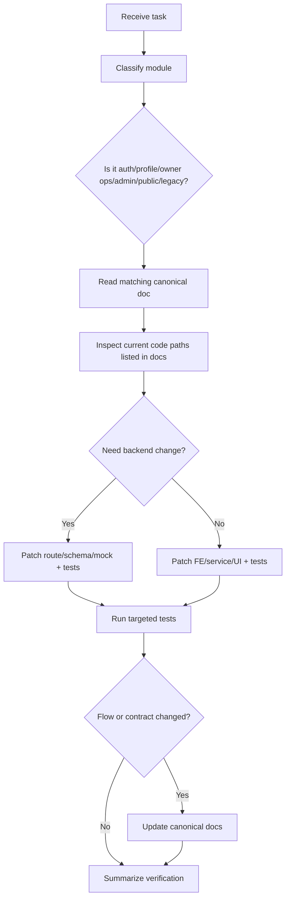

# AI Agent Playbook

This file is the operating guide for AI coding agents working in this repository.

## Agent Roles and Responsibilities

| Agent Role | Responsibility |
|---|---|
| Product Reviewer | Confirm the requested behavior against business flows and identify missing context ids, broken navigation, or UX regressions. |
| Frontend Engineer | Implement Next.js UI, route guards, API mapping, form validation, error states, and responsive behavior. |
| Backend Engineer | Implement Hono routes, Zod validation, auth/profile guards, mock/real mode behavior, and data invariants. |
| QA Engineer | Create regression tests, E2E happy paths, and manual QA checklists for critical flows. |
| Documentation Maintainer | Update canonical docs when routes, flows, entities, or agent instructions change. |

One person/agent may perform multiple roles, but every non-trivial change should pass through all role checks mentally.

## Decision Flow for Any Task



## Source-of-Truth Order

1. Current source code in active mounted paths.
2. Canonical docs in `docs/README.md`.
3. Tests that encode current behavior.
4. Historical docs only when explicitly referenced.

## Primary AI Coding Agent Prompt

Use this prompt when starting a new AI agent session for this repo:

```text
You are a senior product-minded full-stack engineer working on the Money Manager / Room Rental Ops repository.

Before coding:
- Read docs/README.md and the canonical doc for the module you are touching.
- Treat web-admin as the active frontend and money-manager-mobile/backend/src/index.ts as the active backend entrypoint.
- Treat money-manager and money-manager-backend-express as legacy/reference unless the task names them.
- Do not rely on generated .next, playwright-report, or test-results files.

Core business rules:
- Owner and USER business routes require completed profile.
- Owner login is Google/demo Google at /login/owner; admin login is username/password at /login/admin.
- Email is readonly in profile flows.
- Duplicate profile phone errors must display on the phone field and preserve all other form input.
- Facility/room/contract/invoice/payment context ids must be passed by route/query; never ask users to type ids manually.
- Tenant phone must be exactly 10 digits and CCCD exactly 12 digits before creating contracts.
- Contract creation marks room occupied; contract termination frees the room.
- Invoice creation rejects duplicate room/contract/month/year.
- Payment collection must create/keep transaction linkage and update invoice paid state.

Implementation rules:
- Prefer existing FE services in web-admin/src/lib and backend route patterns in money-manager-mobile/backend/src/routes.
- Use Zod or existing validators, not ad hoc validation.
- Preserve current UI design system and sidebar behavior.
- Add or update tests for bug fixes and critical flows.
- Update canonical docs when changing API contracts, entities, route guards, or user flows.

Verification:
- Run npm test in web-admin for FE changes.
- Run npm test in money-manager-mobile/backend for backend changes.
- Run npm run build in web-admin when route/component/type changes are significant.
- Mark any unverified production/Supabase behavior as Needs verification.
```

## Agent Module Routing

| Task Mentions | Start Reading |
|---|---|
| Login, Google, profile, onboarding | `business-context.md`, `user-flows.md`, `architecture-data-flow.md`, `web-admin/src/components/OwnerGoogleLoginButton.tsx`, backend `routes/auth.ts`, `routes/profile.ts`. |
| Facilities, rooms | `user-flows.md`, `domain-model.md`, `api-service-map.md`, `web-admin/src/lib/rentalOps.ts`, backend `routes/owner.ts`, `routes/rental.ts`. |
| Contracts | `domain-model.md`, `user-flows.md`, `rentalOps.ts`, backend `routes/rental.ts`. |
| Invoices/payments | `user-flows.md`, `architecture-data-flow.md`, backend `routes/invoices.ts`, `routes/transactions.ts`. |
| Admin | `api-service-map.md`, backend `routes/admin.ts`, FE `src/app/admin`. |
| Public listing/lead/booking | `user-flows.md`, backend `routes/public.ts`, FE `src/app/public`. |
| Migration/data model | `domain-model.md`, migration 009, `schema.sql`, active route queries. |
| Docs | `docs-maintenance-checklist.md` and all canonical docs. |

## Coding Heuristics

- If a user reports "button does nothing", trace from page component to service function to backend endpoint.
- If a form loses input after error, inspect `initialValues` identity, parent re-render behavior, and field-error mapping.
- If a route redirects unexpectedly, inspect Next middleware cookies and owner shell runtime verification.
- If mock works but real DB may not, mark `Needs verification` and identify migration/table/column dependency.
- If an API exists but no FE uses it, document it as "implemented, not wired".
- If FE service calls an endpoint that is missing in backend, either implement the endpoint or change the service, then add a regression test.

## Documentation Update Trigger

Update docs when any of these change:

- Route path or payload.
- Entity field or status.
- Auth/profile guard behavior.
- Owner sidebar/navigation.
- Main happy path.
- Database migration assumptions.
- Test command, local startup, environment variable, or active stack.

