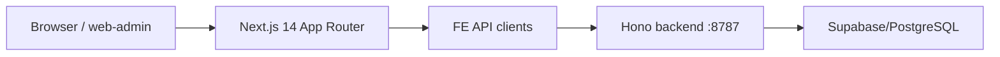
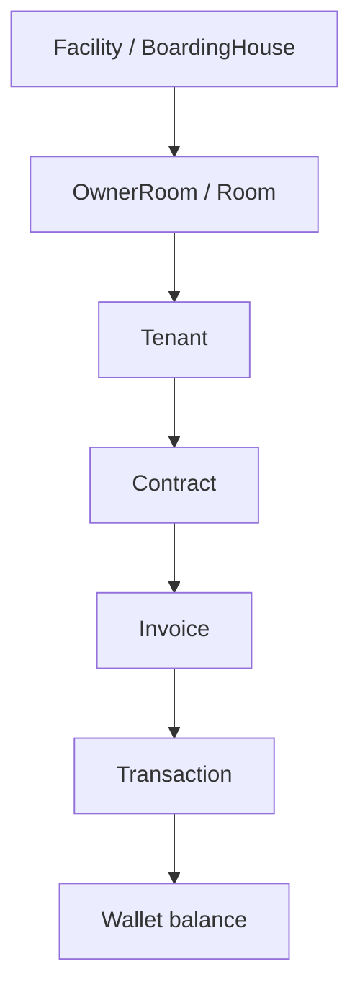
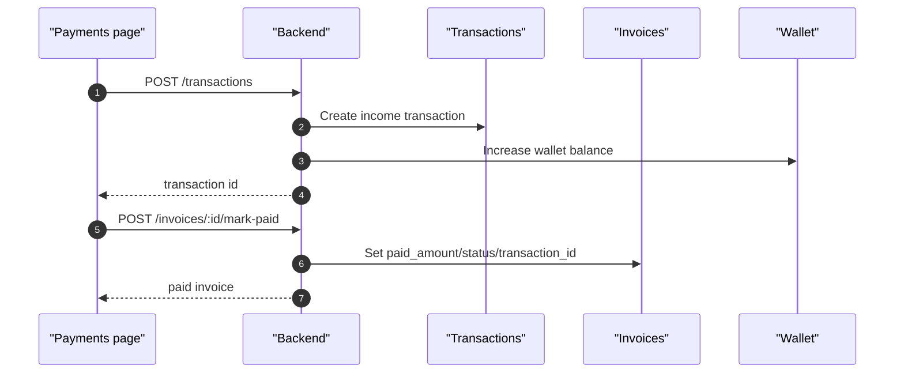
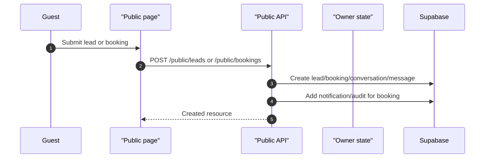

# Architecture and Data Flow

## Runtime Topology

## Active Applications

| Path | Role |
|---|---|
| `web-admin/` | Current frontend for admin, owner workspace, public guest pages, profile onboarding, room-rental ops. |
| `money-manager-mobile/backend/` | Current local backend. Hono entrypoint is `src/index.ts`. |
| `money-manager/` | Legacy Vite React app. Use for behavior reference only. |
| `money-manager-backend-express/` | Legacy Express backend. Use for reference only. |

## Backend Mounting

`money-manager-mobile/backend/src/index.ts` mounts the active Hono routes:

| Mount | Route Module | Notes |
|---|---|---|
| `/health` | `routes/health.ts` | Health check. |
| `/auth` | `routes/auth.ts` | Login, owner Google, admin login, refresh, logout, me. |
| `/me` | `routes/profile.ts` | Profile get/complete/update. |
| `/locations` | `routes/locations.ts` | Static provinces/districts. |
| `/public` | `routes/public.ts` | Public boarding houses, rooms, leads, bookings. |
| `/admin` | `routes/admin.ts` | Admin users, stats, boarding-house/room admin. |
| `/owner` | `routes/owner.ts` | Owner boarding houses, rooms, leads, bookings, messages, notifications, audit, settings. |
| `/wallets` | `routes/wallets.ts` | Wallet CRUD/stats. |
| `/categories` | `routes/categories.ts` | Finance categories. |
| `/transactions` | `routes/transactions.ts` | Ledger transactions. |
| `/rental` | `routes/rental.ts` | Rental rooms, tenants, services, contracts. |
| `/invoices` | `routes/invoices.ts` | Invoices, meter helpers, payment marking, bulk helpers. |
| `/trading` | `routes/trading.ts` | Trading inventory. |
| `/bank-config` | `routes/bankConfig.ts` | Bank/QR config. |

## Auth and Profile Guard

### Frontend

- `web-admin/middleware.ts` protects route groups using cookies:
  - Owner/business routes: `/owner`, `/facilities`, `/contracts`, `/invoices`, `/payments`, `/settings`.
  - Admin routes: `/admin`, `/super-admin`.
- `web-admin/src/components/owner/OwnerWorkspaceShell.tsx` performs runtime verification by calling `/auth/me` and `/me/profile`.
- `web-admin/src/utils/apiClient.ts` redirects to `/complete-profile` when API returns `403 PROFILE_REQUIRED`.

### Backend

- `requireAuth` validates Bearer JWT and attaches `c.set("user", currentUser)`.
- `requireOwner`, `requireAdmin`, and `requireSuperAdmin` enforce role-level authorization.
- `requireCompletedProfile` blocks OWNER/USER business routes when the profile is incomplete.

### Protected Backend Prefixes

`requireCompletedProfile` is applied to:

- `/owner/*`
- `/wallets/*`
- `/categories/*`
- `/transactions/*`
- `/rental/*`
- `/invoices/*`
- `/trading/*`

It is not applied to:

- `/auth/*`
- `/me/profile`
- `/me/profile/complete`
- `/locations/*`
- `/public/*`

### Supabase Integration

All routes utilize the `supabaseAdmin` client (for service-role operations) or a per-request `supabase` client (for user-scoped operations) to interact with the Supabase PostgreSQL database. The schema and migrations (e.g., migration 016) define the tables and relationships.

## Owner Ops Data Flow

## Payment Data Flow

## Public Lead/Booking Data Flow

## Error Handling Conventions

| Error | Current Behavior |
|---|---|
| `401` | FE clears session and redirects to role-appropriate login. |
| `403 PROFILE_REQUIRED` | FE redirects to `/complete-profile` and shows short message. |
| `409 DUPLICATE_PHONE` | Profile form maps `details.fieldErrors.phone` to phone field and keeps other entered values. |
| Zod validation error | Backend returns 400; FE maps known field errors where implemented. |
| Network/API unknown | FE shows local error banner where implemented. |

## Reliability Notes

- Current booking/hold logic checks active bookings in the database.
- Current realtime/event outbox tables exist in migration 009 but no active worker processes them.

## Needs verification

- Real Supabase schema compatibility for all active route queries.
- Whether backend should standardize on `collect-payment` endpoint to avoid split payment writes.
- Whether future `rental_*` schema should replace legacy rental tables in active routes.
