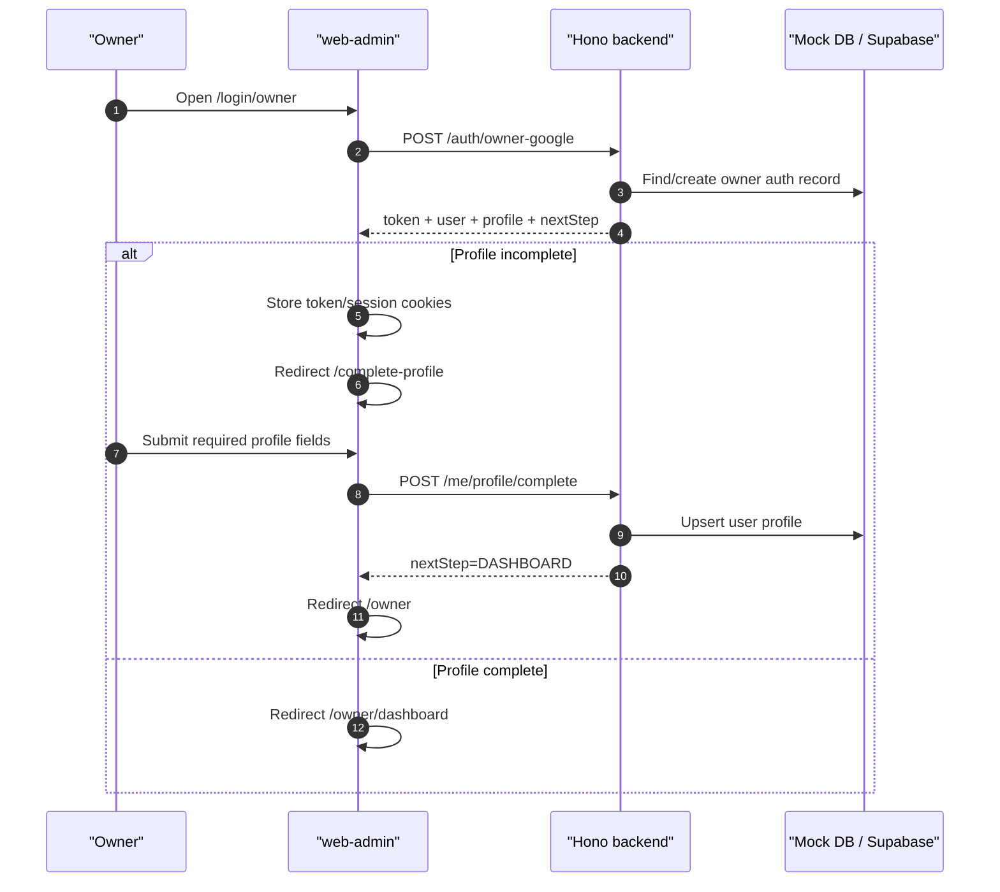

# User Flows

This file documents the main user flows implemented or partially implemented in the current codebase. Each flow lists the route/page, service calls, backend APIs, expected result, and verification notes.

## Flow 1: Owner Google Login and Required Profile

### User Steps

1. Owner opens `/login/owner`.
2. Owner clicks Google sign-in or local demo owner button.
3. Frontend calls `POST /auth/owner-google`.
4. Backend returns access token, user profile state, and `nextStep`.
5. If `nextStep = COMPLETE_PROFILE`, frontend redirects to `/complete-profile`.
6. Owner fills full name, phone, province, district, and address.
7. Frontend calls `POST /me/profile/complete`.
8. Backend stores profile and marks onboarding done.
9. Frontend redirects to `/owner`.

### Code Path

- UI: `web-admin/src/app/login/owner/page.tsx`
- Google button: `web-admin/src/components/OwnerGoogleLoginButton.tsx`
- Complete profile page: `web-admin/src/app/complete-profile/page.tsx`
- Profile service: `web-admin/src/lib/profile.ts`
- Backend auth: `money-manager-mobile/backend/src/routes/auth.ts`
- Backend profile: `money-manager-mobile/backend/src/routes/profile.ts`
- Guard middleware: `money-manager-mobile/backend/src/middleware/requireCompletedProfile.ts`

### Expected Result

- New owner cannot enter owner workspace before profile completion.
- Email is readonly.
- Phone duplicate error is shown only on the phone field and does not reset other form fields.
- Completed owner can access `/owner/dashboard` and profile pages.

### Current Status

Working in local/mock mode. E2E coverage exists in `web-admin/tests/e2e/owner-profile-onboarding.spec.ts`. Unit coverage exists for profile form validation behavior.

### Sequence

## Flow 2: Owner Guarded Workspace

### User Steps

1. Owner navigates to `/owner/*`, `/facilities`, `/contracts`, `/invoices`, `/payments`, or `/settings`.
2. Next middleware checks cookies for token, role, and profile completion.
3. Owner shell calls `/auth/me` and `/me/profile` to verify runtime access.
4. Backend business routes also run `requireCompletedProfile`.

### Code Path

- Next middleware: `web-admin/middleware.ts`
- Owner shell: `web-admin/src/components/owner/OwnerWorkspaceShell.tsx`
- API redirect handling: `web-admin/src/utils/apiClient.ts`
- Backend route mount: `money-manager-mobile/backend/src/index.ts`

### Expected Result

- Missing token redirects to owner/admin login based on route.
- Non-owner accessing owner routes goes to `/not-authorized`.
- Owner with `isProfileCompleted=false` goes to `/complete-profile`.
- API response `PROFILE_REQUIRED` also redirects to `/complete-profile`.

### Needs verification

Cookie state and localStorage can diverge if a developer manually edits storage. The owner shell rechecks backend profile and corrects cookies, but production behavior should be tested in a real browser session.

## Flow 3: Facility and Room Management

### User Steps

1. Owner opens `/facilities`.
2. Frontend loads owner boarding houses from `/owner/boarding-houses`.
3. Owner creates or opens a facility.
4. Facility detail loads owner rooms from `/owner/boarding-houses/:id/rooms` and rental rooms from `/rental/rooms?buildingId=:id`.
5. Owner creates a room from the facility context.
6. Backend creates both owner-facing room and linked mock rental room in local mode.

### Code Path

- Pages: `web-admin/src/app/(owner-ops)/facilities/page.tsx`, `web-admin/src/app/(owner-ops)/facilities/[id]/page.tsx`
- Service: `web-admin/src/lib/rentalOps.ts`
- Backend: `money-manager-mobile/backend/src/routes/owner.ts`, `money-manager-mobile/backend/src/routes/rental.ts`
- Mock state bridge: `mockOwnerState.rooms[].rentalRoomId` links owner room to `mockDb.rooms[]`.

### Expected Result

- Facility cards show counts for total/vacant/occupied/maintenance.
- Room cards show status, floor, area, price, tenant if occupied.
- Vacant room drawer exposes "Tạo hợp đồng".
- Room creation must carry facility context; user should not manually enter facility id.

### Current Status

Working in local/mock happy path. Covered by `owner-rental-billing-flow.spec.ts`.

## Flow 4: Create Contract

### User Steps

1. Owner clicks a vacant room.
2. Owner clicks "Tạo hợp đồng".
3. Frontend navigates to `/contracts/new?room_id=:id&facility_id=:facilityId`.
4. Contract form loads room and available rooms.
5. Owner enters tenant identity and contract details.
6. FE validates tenant fields before API call.
7. FE creates tenant via `POST /rental/tenants`.
8. FE creates contract via `POST /rental/contracts`.
9. Backend marks room occupied.
10. Frontend redirects to `/contracts/:id`.

### Validation Rules

- Tenant phone: exactly 10 digits.
- Tenant CCCD/idCard: exactly 12 digits.
- Tenant email: valid format if provided.
- Billing day: 1-28.

### Code Path

- Page: `web-admin/src/app/(owner-ops)/contracts/new/page.tsx`
- FE validation: `web-admin/src/lib/rentalOps.ts`
- Backend tenant/contract routes: `money-manager-mobile/backend/src/routes/rental.ts`

### Current Status

Working in local/mock happy path. Regression test confirms invalid tenant phone/CCCD does not crash and blocks form progression.

## Flow 5: Create Invoice

### User Steps

1. Owner opens a contract detail page.
2. Owner clicks "Tạo hóa đơn tháng này".
3. Frontend navigates to `/invoices/new?contract_id=:id`.
4. Invoice form loads contract, room, tenant, latest meter readings, and period.
5. Owner inputs electricity/water final readings and optional fees.
6. Frontend calculates totals and calls `POST /invoices`.
7. Backend rejects duplicate invoice for same room/contract/month/year.
8. Frontend redirects to `/invoices/:id`.

### Code Path

- Contract detail: `web-admin/src/app/(owner-ops)/contracts/[id]/page.tsx`
- Invoice create page: `web-admin/src/app/(owner-ops)/invoices/new/page.tsx`
- FE service: `createInvoiceForContract` in `web-admin/src/lib/rentalOps.ts`
- Backend: `money-manager-mobile/backend/src/routes/invoices.ts`

### Current Status

Working in local/mock happy path. Real DB path exists but needs production migration verification.

## Flow 6: Record Payment

### User Steps

1. Owner opens `/invoices/:id`.
2. Owner clicks "Ghi nhận thanh toán".
3. Frontend navigates to `/payments/new?invoice_id=:id`.
4. Payment page loads invoice and wallets.
5. Owner confirms amount, method, date, wallet, collector, and note/transaction code.
6. FE creates income transaction through `POST /transactions`.
7. FE marks invoice paid through `POST /invoices/:id/mark-paid`.
8. Frontend redirects back to invoice detail.
9. Invoice detail shows paid state and transaction id.

### Code Path

- Invoice detail: `web-admin/src/app/(owner-ops)/invoices/[id]/page.tsx`
- Payment page: `web-admin/src/app/(owner-ops)/payments/new/page.tsx`
- FE service: `recordPayment` in `web-admin/src/lib/rentalOps.ts`
- Backend: `money-manager-mobile/backend/src/routes/transactions.ts`, `money-manager-mobile/backend/src/routes/invoices.ts`

### Current Status

Working in local/mock happy path.

### Needs verification

Backend also has `POST /invoices/:id/collect-payment`, but the current FE path uses `/transactions` plus `/invoices/:id/mark-paid`. Do not switch the FE call without testing wallet balance, transaction creation, and invoice status together.

## Flow 7: Public Guest Lead and Booking Request

### User Steps

1. Guest opens `/public/boarding-houses`.
2. Frontend loads `GET /public/boarding-houses`.
3. Guest opens a public boarding house.
4. Frontend loads `GET /public/boarding-houses/:id` and `GET /public/rooms?bhId=:id`.
5. Guest submits lead or booking request.
6. Backend creates lead/conversation/message and optionally booking notification/audit in mock mode.
7. Owner can see lead/booking/message in owner portal mock pages.

### Code Path

- Public pages: `web-admin/src/app/public/boarding-houses/page.tsx`, `web-admin/src/app/public/boarding-houses/[id]/page.tsx`
- Lead component: `web-admin/src/components/LeadForm.tsx`
- Backend: `money-manager-mobile/backend/src/routes/public.ts`, `money-manager-mobile/backend/src/routes/owner.ts`

### Current Status

Working in mock/local mode. Production public lead creation uses `leads` table for lead path and `rental_*` tables for booking path. Needs production schema verification.

## Flow 8: Admin User Management

### User Steps

1. Admin opens `/login/admin`.
2. Admin logs in with username/password.
3. Frontend stores session and redirects to `/admin/users`.
4. Admin lists users, opens user detail, changes status/role, or deletes user.

### Code Path

- Admin login: `web-admin/src/app/login/admin/page.tsx`
- Admin pages: `web-admin/src/app/admin/users/page.tsx`, `web-admin/src/app/admin/users/[id]/page.tsx`
- Backend: `money-manager-mobile/backend/src/routes/admin.ts`

### Current Status

Working in local/mock mode for user list/detail/status/role/delete.

